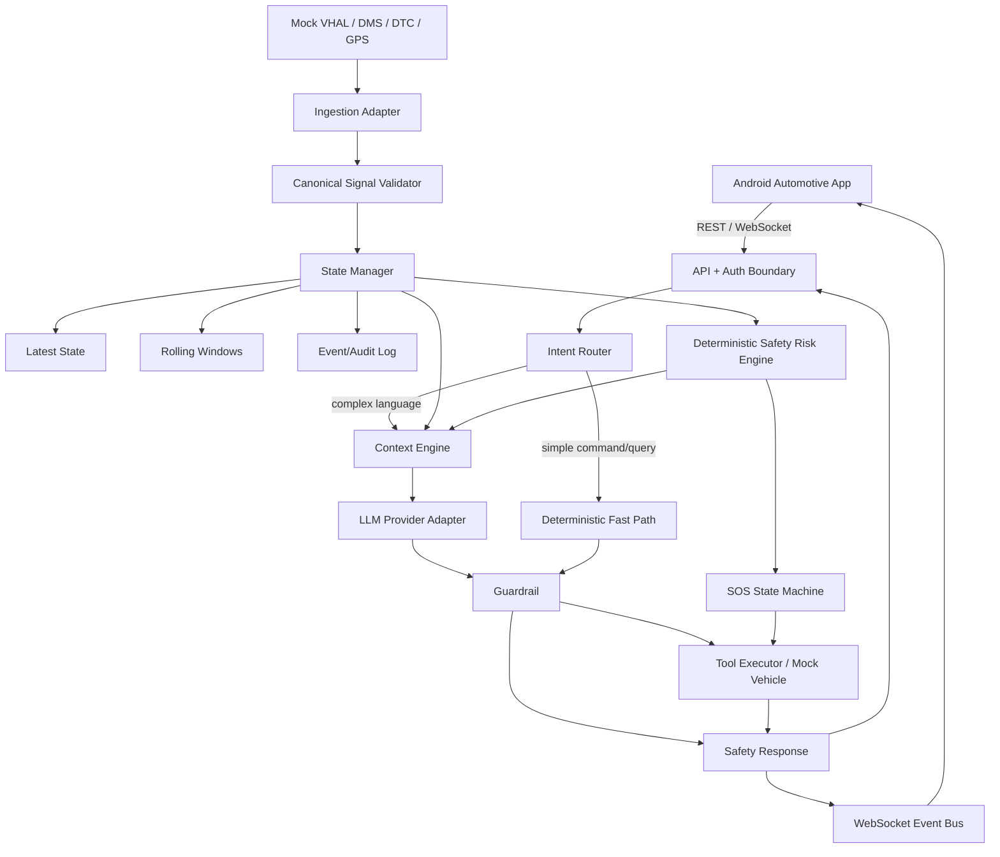
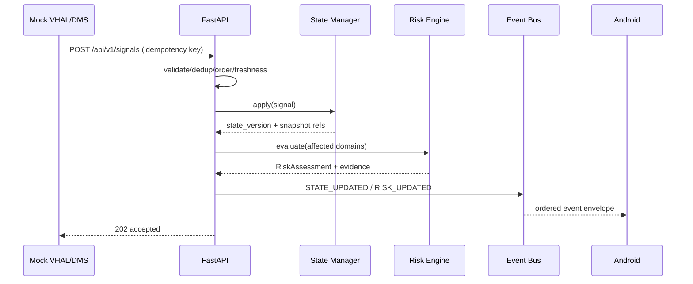
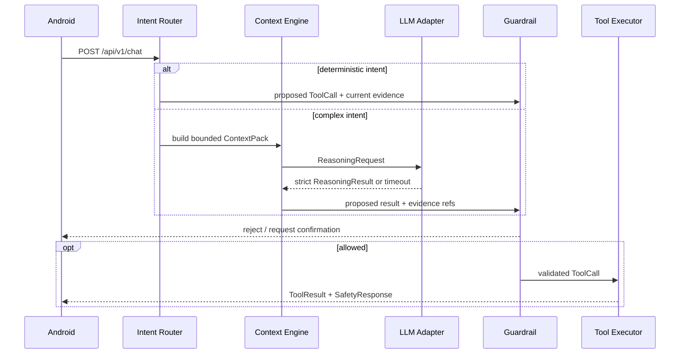
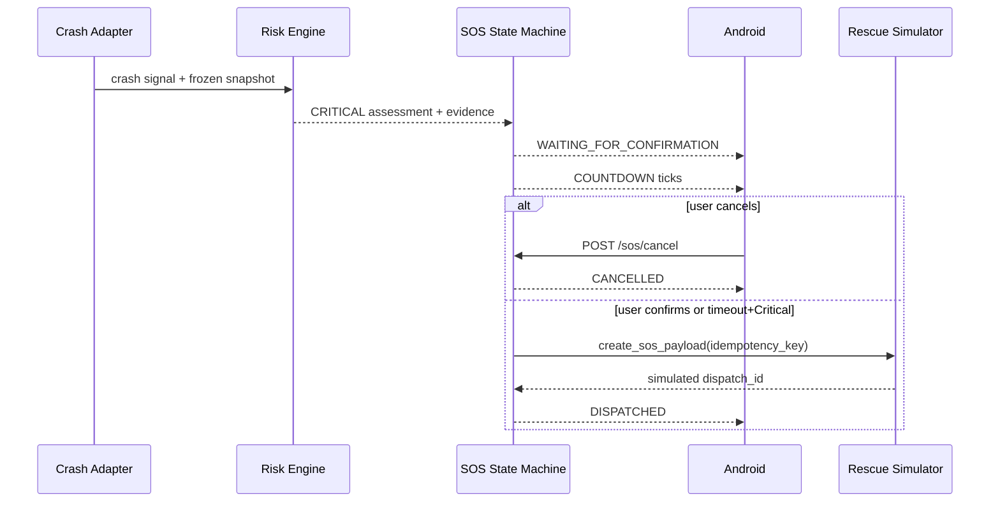
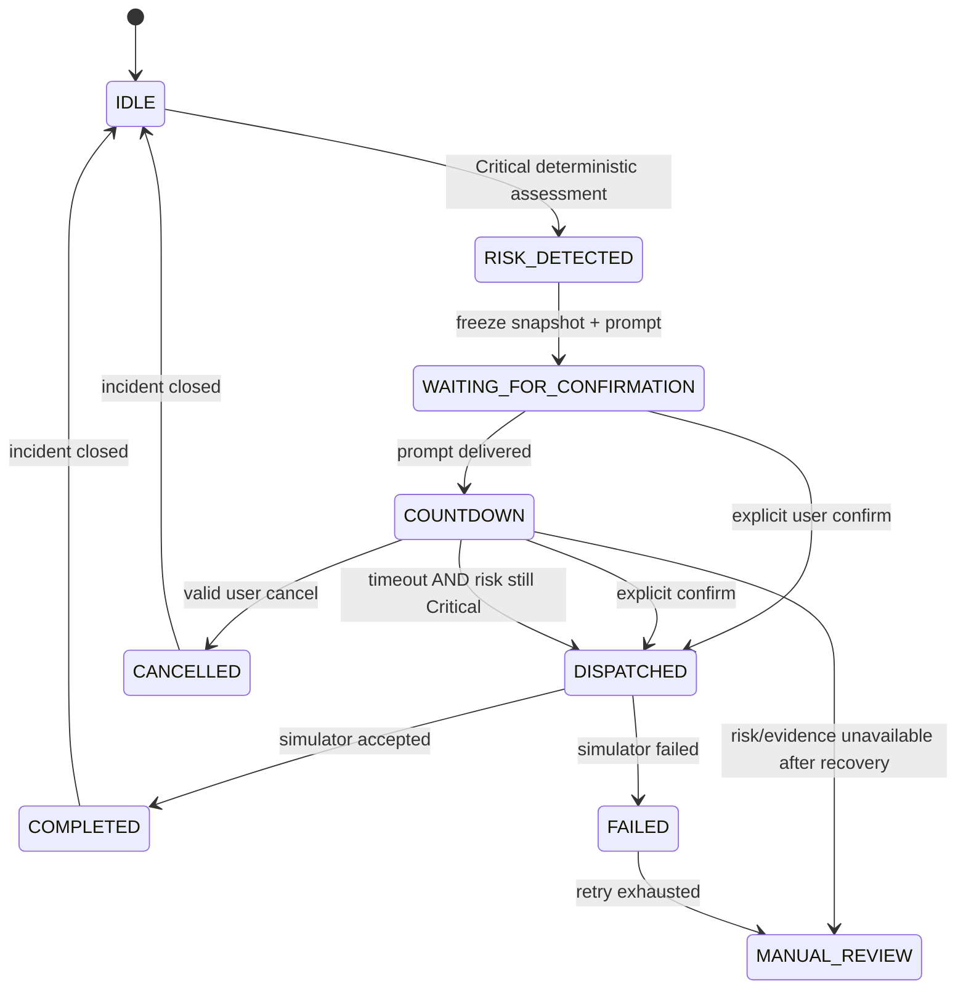

# SafeDrive AI Backend — Master Implementation Plan v2.0

**TECHNICAL DELIVERY BLUEPRINT**

Kế hoạch triển khai từ repository đến demo end-to-end và nền tảng mở rộng.

> [!IMPORTANT]
> **Đây là tài liệu triển khai có thẩm quyền (source of truth).** Claude phải đọc toàn bộ file trước khi sửa code, sau đó triển khai theo task ID, dependency, acceptance criteria và cách kiểm thử đã ghi. Không được tự đổi scope, thứ tự hoặc invariant an toàn.

## Hợp đồng thực thi dành cho Claude

Các từ **PHẢI**, **KHÔNG ĐƯỢC**, **CHỈ** trong phần này là yêu cầu bắt buộc.

1. **Đọc trước khi làm:** PHẢI đọc toàn bộ tài liệu và kiểm tra repository hiện tại trước khi triển khai task đầu tiên.
2. **Task là đơn vị thay đổi:** CHỈ triển khai task ID được yêu cầu và dependency chưa hoàn thành của task đó. Nếu được yêu cầu triển khai toàn bộ plan, vẫn PHẢI làm lần lượt theo dependency/checkpoint; không tạo một mega-change.
3. **Không tự mở rộng scope:** KHÔNG ĐƯỢC thêm microservice, Kafka, Kubernetes, vector database, multi-agent, Redis/PostgreSQL production hoặc cloud dependency vào P0 nếu task không yêu cầu.
4. **Không âm thầm lệch plan:** Nếu repository xung đột với contract, đường dẫn module hoặc dependency trong plan, PHẢI dừng phần xung đột, nêu bằng chứng và đề xuất thay đổi; không tự quyết định một kiến trúc khác.
5. **Contract-first:** KHÔNG ĐƯỢC đổi API path, schema, enum, error code, event envelope, policy threshold hoặc state transition ngoài task đang làm. Mọi thay đổi contract PHẢI cập nhật fixture, test và contract snapshot liên quan.
6. **Hoàn thành có bằng chứng:** Chỉ đánh dấu `DONE` khi acceptance criteria đạt và test nêu trong task đã chạy thành công. Không che phần chưa làm bằng TODO, mock ngầm hoặc dữ liệu giả không gắn nhãn.
7. **Thay đổi nhỏ, kiểm chứng được:** Mỗi lượt triển khai phải giới hạn ở một task hoặc một nhóm task độc lập được chỉ định; giữ commit/change set nhỏ và có thể review.

### Thứ tự ưu tiên khi có mâu thuẫn

1. Invariant an toàn và điều kiện `NO-GO`.
2. Task card cụ thể: dependency, input/output, file/module, acceptance criteria, test.
3. REST/WS/domain contract và SOS state machine.
4. Critical path, integration checkpoint và Definition of Done.
5. Mô tả kiến trúc/phạm vi tổng quát.

Nếu hai yêu cầu cùng cấp vẫn mâu thuẫn, Claude PHẢI báo blocker và xin quyết định; không được tự chọn.

### Invariant an toàn không được thay đổi

- `Risk Engine` là deterministic. LLM KHÔNG ĐƯỢC quyết định `risk_level`, sửa state an toàn hoặc trở thành source of truth.
- Mọi tool action PHẢI đi qua `Guardrail`; `Tool Executor` CHỈ nhận `GuardrailResult.validated_tool_call`.
- Dữ liệu thiếu, stale, replay, quality thấp hoặc policy/evidence resolver lỗi phải **fail-closed**; không được mặc định thành `LOW` hoặc “best effort”.
- Không gửi raw sensor/audio/video stream vào LLM. `Context Engine` chỉ gửi bounded, allowlisted, redacted `ContextPack`.
- LLM KHÔNG ĐƯỢC tạo, xác nhận hoặc dispatch SOS. Chỉ deterministic `Critical` eligibility mới tạo incident; dispatch chỉ theo user confirmation hoặc countdown timeout hợp lệ trong SOS state machine.
- DMS/cabin-derived feature chỉ được dùng trong profile mô phỏng. Tên runtime chuẩn là `DMS_DEMO`; `DEMO_SIMULATED` trong phần mô tả được hiểu là nhãn mô phỏng, không phải enum thứ ba. Production dùng `PRODUCTION_NO_DMS`.
- Rescue/SOS, VHAL, GPS, DMS và cloud LLM trong demo phải dùng adapter/mock/fixture đúng scope và có nhãn `simulated=true` khi plan yêu cầu.
- Không secret, PII, raw stream hoặc vị trí thật trong log, fixture, prompt hay source control.

### Quy trình thực thi một task

1. Xác định task ID và đọc toàn bộ task card cùng các section contract liên quan.
2. Kiểm tra dependency trong repository; liệt kê dependency thiếu trước khi sửa.
3. Xác nhận file/module dự kiến và contract không được phá vỡ.
4. Triển khai đúng input, output và giới hạn scope của task.
5. Chạy test được nêu trong task, cộng regression test tối thiểu cho contract/safety bị ảnh hưởng.
6. Đối chiếu acceptance criteria từng dòng bằng bằng chứng cụ thể.
7. Báo cáo theo mẫu dưới đây; chỉ đề xuất task tiếp theo đã đủ dependency.

```text
TASK: SD-XXXX — <tên task>
STATUS: DONE | BLOCKED
DEPENDENCIES VERIFIED: <danh sách + bằng chứng>
FILES CHANGED: <danh sách>
CONTRACT CHANGES: NONE | <mô tả và fixture/test đi kèm>
ACCEPTANCE EVIDENCE:
- <criterion> → <bằng chứng>
TESTS:
- <command> → PASS/FAIL
SAFETY/SECURITY CHECKS: <kết quả>
DEVIATIONS: NONE | <lý do + phê duyệt cần có>
NEXT ELIGIBLE TASKS: <task ID>
```

### Prompt khởi động đề xuất cho Claude

```text
Đọc toàn bộ file SafeDrive_AI_Backend_Master_Implementation_Plan_V2_CLAUDE.md.
Xem tài liệu là source of truth và tuân thủ Hợp đồng thực thi dành cho Claude.
Kiểm tra trạng thái repository trước khi sửa.
Task hiện tại: <SD-XXXX hoặc danh sách task được chỉ định>.
Chỉ triển khai scope của task và dependency còn thiếu; không tự đổi contract/invariant.
Chạy test, đối chiếu từng acceptance criterion và báo cáo theo mẫu trong tài liệu.
```

## Baseline tài liệu nguồn

| Thuộc tính | Nội dung |
| --- | --- |
| Phiên bản | 2.0 — Master plan đã tự review và tối ưu |
| Ngày baseline | 27/07/2026 |
| Đích P0 | Android ↔ REST/WebSocket ↔ Backend ↔ mock vehicle/DMS/DTC/SOS |
| Thời gian P0 dự kiến | 8–10 ngày làm việc với 4 vai trò có thể chạy song song |
| Safety stance | Deterministic risk; LLM không có quyền quyết định risk hoặc bypass Guardrail |
| Môi trường demo | Laptop/Ubuntu hoặc Windows + Docker; Cloud LLM là tùy chọn, không phải dependency an toàn |

> [!IMPORTANT]
> Quyết định chủ đạo: Phát triển theo ba vertical slice. Slice 1 phải đưa tín hiệu mô phỏng lên Android trong 24 giờ; slice 2 chứng minh fast path/Guardrail; slice 3 chứng minh crash–countdown–SOS mô phỏng và audit.

> [!WARNING]
> Giới hạn dữ liệu hiện tại: Đặc tả hiện có cho biết MVP thật chưa có DMS/camera. PERCLOS, eye closure, yawning, head pose và passenger pose chỉ được dùng trong profile DEMO_SIMULATED có nhãn rõ; profile PRODUCTION_NO_DMS không được kết luận buồn ngủ hoặc tình trạng y tế từ tín hiệu không tồn tại.

## Mục lục

- [1. Executive Summary](#section-01)
- [2. Các giả định đang sử dụng](#section-02)
- [3. Những câu hỏi còn thiếu nhưng không ngăn cản việc lập plan](#section-03)
- [4. Scope P0, P1, P2 và Out of Scope](#section-04)
- [5. Actors và danh sách use case](#section-05)
- [6. Kiến trúc MVP](#section-06)
- [7. Kiến trúc mở rộng](#section-07)
- [8. Mermaid architecture diagram](#section-08)
- [9. End-to-end sequence diagram](#section-09)
- [10. Domain model](#section-10)
- [11. Canonical signal schema](#section-11)
- [12. State Manager design](#section-12)
- [13. Intent Router design](#section-13)
- [14. Context Engine design](#section-14)
- [15. Safety Risk Engine design](#section-15)
- [16. LLM Adapter design](#section-16)
- [17. Guardrail design](#section-17)
- [18. Tool Executor design](#section-18)
- [19. SOS state machine](#section-19)
- [20. REST API contract](#section-20)
- [21. WebSocket contract](#section-21)
- [22. Repository structure](#section-22)
- [23. Roadmap theo phase](#section-23)
- [24. Task breakdown 2–8 giờ](#section-24)
- [25. Critical path](#section-25)
- [26. Các task có thể làm song song](#section-26)
- [27. Integration checkpoints](#section-27)
- [28. Testing strategy](#section-28)
- [29. Deployment plan](#section-29)
- [30. CI/CD plan](#section-30)
- [31. Security checklist](#section-31)
- [32. Risk register](#section-32)
- [33. Definition of Done](#section-33)
- [34. Danh sách công việc trong 24 giờ đầu](#section-34)
- [35. Kịch bản demo end-to-end](#section-35)
- [36. Tự review kỹ thuật và Plan V2 tối ưu](#section-36)

## Chỉ mục thực thi 52 task

Bảng này được sinh từ task card ở phần 24. Dependency phân tách bằng dấu phẩy được hiểu là phải thỏa tất cả; ký hiệu `A..B` là toàn bộ dải task từ A đến B.

| Phase | Task | Mục tiêu | Dependency | Owner / thời lượng |
| --- | --- | --- | --- | --- |
| 24.0 | [SD-0001](#task-sd-0001) — Chốt capability profile | Xác định nguồn dữ liệu thật/mô phỏng và nhãn capability. | — | Safety + Android / 3h |
| 24.0 | [SD-0002](#task-sd-0002) — Khóa scope và success metrics | Chốt P0/P1/out và KPI. | SD-0001 | PM/Tech Lead / 3h |
| 24.0 | [SD-0003](#task-sd-0003) — Khóa contract v1 | Chốt envelopes, IDs, time, errors, WS event. | SD-0002 | Backend + Android / 6h |
| 24.0 | [SD-0004](#task-sd-0004) — Safety policy baseline | Chốt rules, gates, confirmations, SOS invariants. | SD-0001 | Safety Owner / 6h |
| 24.1 | [SD-0101](#task-sd-0101) — Khởi tạo repository | Tạo pyproject/package/test layout/pre-commit. | SD-0002 | Backend / 3h |
| 24.1 | [SD-0102](#task-sd-0102) — FastAPI app factory | Dựng lifespan, router v1, docs. | SD-0101 | Backend / 4h |
| 24.1 | [SD-0103](#task-sd-0103) — Config và secret boundary | Typed env config; validate startup. | SD-0101 | Backend/DevOps / 3h |
| 24.1 | [SD-0104](#task-sd-0104) — Logging/error/request context | Structured JSON, request_id, unified errors. | SD-0102 | Backend / 5h |
| 24.1 | [SD-0105](#task-sd-0105) — Docker foundation | Non-root image và compose local. | SD-0101,SD-0103 | DevOps / 4h |
| 24.1 | [SD-0106](#task-sd-0106) — CI quality gate | Ruff, MyPy, unit, build. | SD-0101 | DevOps / 4h |
| 24.2 | [SD-0201](#task-sd-0201) — Canonical models/registry | Implement signal envelope và per-type schemas. | SD-0003,SD-0001 | Backend / 6h |
| 24.2 | [SD-0202](#task-sd-0202) — Dedup/order/quarantine | Handle duplicate, replay, late/invalid. | SD-0201 | Backend / 6h |
| 24.2 | [SD-0203](#task-sd-0203) — Latest State Manager | Atomic component updates/version/freshness. | SD-0202 | Backend / 7h |
| 24.2 | [SD-0204](#task-sd-0204) — Rolling windows | Event-time bounded feature windows. | SD-0202 | Backend/Safety / 5h |
| 24.2 | [SD-0205](#task-sd-0205) — Signal/state REST slice | Expose POST signals và GET state. | SD-0203 | Backend / 5h |
| 24.2 | [SD-0206](#task-sd-0206) — WS state broadcaster | Publish ordered state events. | SD-0205 | Backend / 6h |
| 24.3 | [SD-0301](#task-sd-0301) — Risk engine core | Evaluator interface, score mapping, evidence. | SD-0004,SD-0203 | Safety/Backend / 6h |
| 24.3 | [SD-0302](#task-sd-0302) — Driver evaluator | DMS_DEMO và NO_DMS profiles. | SD-0301,SD-0204 | Safety / 6h |
| 24.3 | [SD-0303](#task-sd-0303) — Passenger evaluator | Occupancy/motion/posture/crash rules. | SD-0301 | Safety / 5h |
| 24.3 | [SD-0304](#task-sd-0304) — DTC evaluator/catalog | Map known DTC; conservative unknown. | SD-0301 | Backend/Safety / 5h |
| 24.3 | [SD-0305](#task-sd-0305) — Post-crash evaluator | Frozen evidence và Critical gate. | SD-0301,SD-0203 | Safety / 6h |
| 24.3 | [SD-0306](#task-sd-0306) — Risk/WS integration | Evaluate affected domain on state commit. | SD-0302..SD-0305,SD-0206 | Backend / 6h |
| 24.4 | [SD-0401](#task-sd-0401) — Deterministic intent parser | Fast intents/entities/confidence. | SD-0003 | Backend / 6h |
| 24.4 | [SD-0402](#task-sd-0402) — Context builder | Intent allowlist/freshness/evidence/token cap. | SD-0301,SD-0401 | Backend/Safety / 6h |
| 24.4 | [SD-0403](#task-sd-0403) — Mock LLM provider | Deterministic outputs/fault modes. | SD-0402 | LLM/Backend / 4h |
| 24.4 | [SD-0404](#task-sd-0404) — Cloud provider adapter | Async strict output, timeout, usage. | SD-0403,SD-0103 | LLM Lead / 6h |
| 24.4 | [SD-0405](#task-sd-0405) — Deterministic fallback | Safe messages per intent/risk/failure. | SD-0401,SD-0301 | Safety/Backend / 4h |
| 24.4 | [SD-0406](#task-sd-0406) — Chat orchestration | Fast/LLM/fallback request flow. | SD-0401..SD-0405 | Backend / 7h |
| 24.5 | [SD-0501](#task-sd-0501) — Tool registry/schemas | Register tools/policies/adapters. | SD-0004 | Backend/Safety / 5h |
| 24.5 | [SD-0502](#task-sd-0502) — Guardrail pipeline | Implement ordered default-deny checks. | SD-0501,SD-0402 | Safety/Backend / 8h |
| 24.5 | [SD-0503](#task-sd-0503) — Confirmation service | One-time TTL action confirmations. | SD-0502 | Backend / 5h |
| 24.5 | [SD-0504](#task-sd-0504) — Mock vehicle tools | Implement HVAC/window/status/DTC/warnings. | SD-0501,SD-0203 | Backend / 7h |
| 24.5 | [SD-0505](#task-sd-0505) — Tool execution/audit | Timeout/idempotency/result persistence. | SD-0502..SD-0504 | Backend / 6h |
| 24.6 | [SD-0601](#task-sd-0601) — SOS state model/transitions | Implement explicit transition table. | SD-0305 | Safety/Backend / 6h |
| 24.6 | [SD-0602](#task-sd-0602) — Frozen crash snapshot | Persist incident evidence refs/version. | SD-0305,SD-0601 | Backend / 4h |
| 24.6 | [SD-0603](#task-sd-0603) — Async countdown/ticks | Server-owned cancellable timer. | SD-0601,SD-0206 | Backend / 5h |
| 24.6 | [SD-0604](#task-sd-0604) — SOS API + simulator | Confirm/cancel/status/payload endpoint adapter. | SD-0601..SD-0603 | Backend / 7h |
| 24.6 | [SD-0605](#task-sd-0605) — SOS WS/audit integration | Publish durable lifecycle events. | SD-0604,SD-0206 | Backend / 5h |
| 24.7 | [SD-0701](#task-sd-0701) — Android contract models | Generate/implement v1 DTO/error handling. | SD-0003 | Android / 6h |
| 24.7 | [SD-0702](#task-sd-0702) — REST screens/actions | State/chat/DTC/SOS UI states. | SD-0701,SD-0205,SD-0406 | Android / 8h |
| 24.7 | [SD-0703](#task-sd-0703) — WS/reconnect client | Sequence/dedup/resync/backoff. | SD-0701,SD-0206 | Android / 7h |
| 24.7 | [SD-0704](#task-sd-0704) — Device connectivity setup | adb reverse/LAN/base URL/TLS debug profile. | SD-0102 | Android/DevOps / 4h |
| 24.8 | [SD-0801](#task-sd-0801) — Audit repository | SQLite append/query/redaction. | SD-0104 | Backend / 6h |
| 24.8 | [SD-0802](#task-sd-0802) — Contract suite | Validate OpenAPI/examples/Android fixtures. | SD-0003,SD-0701 | QA / 5h |
| 24.8 | [SD-0803](#task-sd-0803) — Safety adversarial suite | Stale/missing/replay/injection/LLM/tool/SOS cases. | SD-0505,SD-0605 | Safety/QA / 8h |
| 24.8 | [SD-0804](#task-sd-0804) — 10 E2E scenarios | Automate required demo paths. | SD-0605,SD-0703 | QA / 8h |
| 24.8 | [SD-0805](#task-sd-0805) — Performance test | Measure update/REST/WS/risk/concurrency/memory. | SD-0306,SD-0406 | QA/DevOps / 6h |
| 24.8 | [SD-0806](#task-sd-0806) — Security hardening | Rate/size/auth/replay/log/scan. | SD-0103,SD-0505 | Security/DevOps / 7h |
| 24.9 | [SD-0901](#task-sd-0901) — Local deployment runbook | Clean-machine Docker/local startup. | SD-0105,SD-0804 | DevOps / 4h |
| 24.9 | [SD-0902](#task-sd-0902) — Cloud staging option | Deploy container with HTTPS/WS/health. | SD-0105,SD-0806 | DevOps / 6h |
| 24.9 | [SD-0903](#task-sd-0903) — Demo data/offline pack | Bundle fixtures, MockProvider, scripted scenarios. | SD-0804 | QA/Backend / 4h |
| 24.9 | [SD-0904](#task-sd-0904) — Final release/rehearsal | Run gates, tag image, rollback, presenter script. | SD-0901..SD-0903 | Tech Lead/PM / 6h |

---

<a id="section-01"></a>

# 1. Executive Summary

SafeDrive AI Backend là một modular monolith bất đồng bộ, đóng vai trò ranh giới tin cậy giữa Android Automotive và các nguồn vehicle/perception/LLM. P0 không cố xây hệ thống production phân tán; nó chứng minh ba điều: (1) dữ liệu có nguồn gốc và freshness rõ; (2) risk và SOS được quyết định deterministic; (3) Android nhận phản hồi và sự kiện realtime kể cả khi LLM hoặc Internet hỏng.

| Mục tiêu | Quyết định | Chỉ số nghiệm thu |
| --- | --- | --- |
| Demo end-to-end | Ba vertical slice, contract-first | 10 E2E scenario pass; REST + WS hoạt động |
| An toàn | Risk engine + Guardrail fail-closed | 0 tool nhạy cảm bypass; mọi quyết định có evidence/audit |
| Latency | Fast path local; async LLM có hard timeout | Deterministic P95 < 1,5 s; mục tiêu fast path < 500 ms |
| Khả dụng | LLM optional cho safety | Provider down vẫn ingest, risk, warning và SOS simulation |
| Mở rộng | Ports/adapters; state interface | Đổi provider/Redis/Postgres không viết lại domain core |

- MVP bắt buộc: Python 3.11, FastAPI, Pydantic v2, Uvicorn, asyncio, Pytest, HTTPX, Ruff, MyPy, Docker, OpenAPI, structured log, in-memory state và SQLite audit.

- Production-later: Redis, PostgreSQL, JWT/OIDC, managed metrics/tracing, autoscaling và secret manager.

- Không đưa Kafka, Kubernetes, microservice, vector database hoặc multi-agent vào P0.

<a id="section-02"></a>

# 2. Các giả định đang sử dụng

| Chủ đề | Giả định/decision mặc định |
| --- | --- |
| Team | 4 vai trò có thể song song: Backend/Core, Safety/QA, Android, Platform/LLM/DevOps. |
| Timeline | P0 mục tiêu 8–10 ngày; full P1 thêm 1–2 sprint. |
| Vehicle | Không điều khiển xe thật; VHAL/HVAC/window/DTC/crash đều mock hoặc adapter demo. |
| DMS | Không có DMS thật trong baseline hiện tại; feature camera chỉ hợp lệ khi source=SIMULATOR và metadata.simulated=true. |
| SOS | Chỉ tạo payload và gọi rescue simulation service; không gọi số khẩn cấp thật. |
| Identity | Một vehicle/trip active trên một backend process trong demo; ID đã ẩn danh. |
| Network | Android và laptop cùng LAN hoặc adb reverse; backend có thể mất Internet mà safety vẫn chạy. |
| LLM | Một provider chính, một MockProvider; không cần fallback cloud thứ hai cho P0. |
| Time | Server nhận UTC ISO-8601; clock skew chấp nhận ±30 s cho telemetry demo, event quá lệch bị quarantine. |
| Persistence | Latest/rolling window in-memory; audit SQLite. Restart được phép mất rolling window nhưng phải ghi recovery event. |
| Authentication | API key ngắn hạn ở gateway demo; key được inject, không hard-code trong APK/repo. |
| Threshold | Các threshold trong tài liệu là baseline demo/hackathon, không phải tiêu chuẩn y tế hay homologation ô tô. |

<a id="section-03"></a>

# 3. Những câu hỏi còn thiếu nhưng không ngăn cản việc lập plan

| ID | Câu hỏi | Mặc định để tiếp tục | Owner |
| --- | --- | --- | --- |
| Q01 | Android dùng phone, emulator hay AAOS head unit? | Mặc định phone/emulator; contract không phụ thuộc form factor. | Android Lead |
| Q02 | Vehicle signal thực có trường nào? | Chạy mock profile; capability manifest khai báo unavailable. | Vehicle/Android |
| Q03 | Provider/model LLM nào? | Provider-neutral interface + MockProvider; chọn ở task P4-01. | LLM Lead |
| Q04 | Countdown SOS bao lâu? | 10 giây cho demo, config; production cần safety review. | Safety Owner |
| Q05 | DTC knowledge base nào? | Fixture 8–12 mã demo, unknown code → conservative warning/manual review. | Backend/Safety |
| Q06 | Ngôn ngữ? | vi-VN chính, text fallback en-US; schema không phụ thuộc locale. | Product |
| Q07 | Số client đồng thời? | 1–5 Android clients cho demo; benchmark 20 WS connections. | DevOps |
| Q08 | Retention audit? | 7 ngày local demo hoặc xóa theo trip; production cần quyết định pháp lý. | Security |
| Q09 | GPS permission? | Thiếu GPS không ngăn risk; payload đánh dấu location_unavailable. | Android/Safety |
| Q10 | Mức xác nhận tool nào? | Tool policy YAML trong phần 18 là mặc định. | Safety Owner |

<a id="section-04"></a>

# 4. Scope P0, P1, P2 và Out of Scope

| Mức | Phạm vi | Ý nghĩa |
| --- | --- | --- |
| P0 | FastAPI foundation; canonical signal; latest state + rolling windows; 4 risk evaluators; deterministic intent fast path; bounded context; Mock/Cloud LLM adapter; Guardrail; mock tools; SOS state machine; REST/WS; SQLite audit; Docker; CI; 10 E2E. | Bắt buộc để demo. |
| P1 | Redis state adapter; PostgreSQL audit; richer DTC catalog; JWT; rate limiter; conversation summary; reconnect replay buffer; metrics exporter; basic cloud staging. | Sau khi P0 ổn định. |
| P2 | Real VHAL/DMS/OBD adapters; model calibration; multi-vehicle tenancy; HA; edge accelerator; fleet dashboard; production incident integration. | Mở rộng có governance. |
| Out | Điều khiển ECU thật, autonomous driving, medical diagnosis, emergency dispatch thật, certification ISO 26262/SOTIF, raw video/audio retention, model training, Kafka/K8s/microservices cho MVP. | Không cam kết trong dự án demo. |

## 4.1 Những phần phải mock trong hackathon

- VHAL/HVAC/window/seatbelt/speed/crash sensor bằng scenario fixture có timestamp, quality và simulated=true.

- DMS và cabin camera feature chỉ trong demo profile; UI phải hiển thị “Mô phỏng”.

- DTC catalog bằng fixture nhỏ có severity/recommendation được review.

- Rescue/SOS service chỉ trả dispatch_id mô phỏng, tuyệt đối không gọi dịch vụ thật.

- LLM có MockProvider deterministic để chạy offline và test failure.

- GPS dùng tọa độ giả; không dùng vị trí thật nếu chưa có consent.

<a id="section-05"></a>

# 5. Actors và danh sách use case

| Actor | Vai trò | Trust boundary |
| --- | --- | --- |
| Android Automotive App | HMI, voice/text, REST/WS client | Không tin risk/action do client tự gán |
| Driver | Yêu cầu, xác nhận/hủy, nhận cảnh báo | Input có thể mơ hồ/prompt injection |
| Passenger | Đối tượng occupancy/safety; có thể phản hồi | Không chẩn đoán y tế |
| Mock Vehicle System | VHAL/DTC/crash/HVAC signal và tool sink | Mọi signal cần source/quality/time |
| Perception Model | Feature DMS/cabin đã tổng hợp | Không gửi raw stream; confidence/freshness bắt buộc |
| LLM Provider | Giải thích, hỏi, đề xuất allowed tool | Không có quyền risk/tool execution |
| Rescue Simulation | Nhận SOS payload mô phỏng | Idempotency; không dispatch thật |
| Developer/Operator | Config, quan sát, replay scenario | Không sửa audit; secret redaction |

## UC01 Điều khiển HVAC/window

| Thuộc tính | Nội dung |
| --- | --- |
| Trigger | Text/voice rõ |
| Preconditions | State fresh, capability có sẵn |
| Input | Intent + current state |
| Happy path | Fast path → Guardrail → mock tool |
| Failure path | Invalid/stale/unsafe → reject |
| Edge cases | Đơn vị, ngoài range, xe tốc độ cao |
| Output | SafetyResponse + TOOL_EXECUTED |
| Audit | request/tool/state version |
| Safety | Không bypass Guardrail; confirm window khi xe chạy |

## UC02 Vehicle status

| Thuộc tính | Nội dung |
| --- | --- |
| Trigger | User hỏi trạng thái |
| Preconditions | Có latest state |
| Input | Intent + selected signals |
| Happy path | Trả fact + freshness |
| Failure path | Thiếu → nói unavailable |
| Edge cases | Mixed stale/fresh |
| Output | Structured status |
| Audit | request/context refs |
| Safety | Không phát minh state |

## UC03 DTC

| Thuộc tính | Nội dung |
| --- | --- |
| Trigger | DTC event hoặc query |
| Preconditions | Catalog/policy loaded |
| Input | Active DTC |
| Happy path | Map severity + explain |
| Failure path | Unknown code → conservative |
| Edge cases | DTC stale/cleared |
| Output | DTC summary/action |
| Audit | DTC evidence/version |
| Safety | LLM không đổi severity |

## UC04 Driver support

| Thuộc tính | Nội dung |
| --- | --- |
| Trigger | Periodic event/user reports fatigue |
| Preconditions | Profile capability rõ |
| Input | Driving time + optional DMS |
| Happy path | Deterministic score → warning |
| Failure path | Missing feature → lower confidence |
| Edge cases | Vehicle stopped; repeated warning |
| Output | RiskAssessment + warning |
| Audit | rules/evidence |
| Safety | No medical claim; no raw camera |

## UC05 Passenger abnormality

| Thuộc tính | Nội dung |
| --- | --- |
| Trigger | Cabin feature/event |
| Preconditions | Occupancy known |
| Input | Motion/posture/crash/response |
| Happy path | Risk + ask driver |
| Failure path | No occupancy/missing → no claim |
| Edge cases | Child seat; sensor noise |
| Output | Warning/confirmation |
| Audit | evidence/source |
| Safety | No diagnosis; Critical gated |

## UC06 Post-crash/SOS

| Thuộc tính | Nội dung |
| --- | --- |
| Trigger | Crash/hard impact |
| Preconditions | Event valid/not replay |
| Input | Frozen snapshot |
| Happy path | Risk → confirmation/countdown |
| Failure path | Invalid/stale → manual review |
| Edge cases | No GPS; user cancel; duplicate |
| Output | SOS status/payload |
| Audit | All transitions |
| Safety | Only Critical deterministic or explicit confirm |

## UC07 Roadside assistance

| Thuộc tính | Nội dung |
| --- | --- |
| Trigger | Critical DTC/user request |
| Preconditions | Vehicle state + consent |
| Input | DTC/location availability |
| Happy path | Confirm → simulated request |
| Failure path | Provider fail → payload retained |
| Edge cases | Duplicate request |
| Output | dispatch_id mock |
| Audit | confirmation/idempotency |
| Safety | Never real dispatch in demo |

## UC08 LLM complex query

| Thuộc tính | Nội dung |
| --- | --- |
| Trigger | No deterministic match |
| Preconditions | Bounded ContextPack |
| Input | Sanitized text/context |
| Happy path | Structured output → Guardrail |
| Failure path | Timeout/schema error → deterministic fallback |
| Edge cases | Injection/low confidence |
| Output | Safe response |
| Audit | provider usage/fallback |
| Safety | LLM cannot supply evidence absent from context |

## UC09 WS synchronization

| Thuộc tính | Nội dung |
| --- | --- |
| Trigger | State/risk/tool/SOS event |
| Preconditions | Authenticated connection |
| Input | Event envelope |
| Happy path | Sequence + ACK-by-state resync |
| Failure path | Disconnect → reconnect/snapshot |
| Edge cases | Slow consumer/duplicate |
| Output | Realtime UI |
| Audit | connect/drop/sequence |
| Safety | No sensitive raw payload |

<a id="section-06"></a>

# 6. Kiến trúc MVP

MVP là modular monolith: một process FastAPI, các module domain tách bằng interface nhưng deploy chung. Ingestion và request path dùng asyncio; risk engine thuần deterministic; state update không kích hoạt LLM. Audit SQLite chạy qua repository async/bounded queue; WebSocket broadcaster có queue giới hạn.

| Khối | Trách nhiệm | Store/dependency | SLA nội bộ |
| --- | --- | --- | --- |
| API/Auth | Validate envelope, API key, request ID, error format | FastAPI/Pydantic | ≤50 ms |
| Ingestion | Normalize, dedup, order, quarantine | Canonical schemas | ≤40 ms |
| State Manager | Latest/rolling/snapshot/version | In-memory | ≤20 ms |
| Risk Engine | Rules/evidence/recommendation | YAML versioned | ≤30 ms |
| Intent/Context | Fast routing; bounded data | Rule tables | ≤50 ms |
| LLM Adapter | Async structured output, timeout | Mock + optional cloud | Hard timeout 2,5 s |
| Guardrail/Tools | Policy checks and execution | YAML registry | ≤100 ms excluding mock delay |
| SOS | Single active workflow/countdown | In-memory + audit | Tick 1 s |
| WS/Audit | Event stream and immutable record | Queue + SQLite | Publish ≤100 ms |

> [!IMPORTANT]
> Fast path: HVAC, fan, vehicle query, SOS confirm/cancel và known DTC lookup không gọi LLM.

<a id="section-07"></a>

# 7. Kiến trúc mở rộng

Khi cần nhiều instance, giữ nguyên domain ports: StateRepository chuyển sang Redis; AuditRepository sang PostgreSQL; WebSocket fan-out dùng Redis Streams/PubSub; gateway cấp JWT/OIDC. Chỉ tách service khi có số liệu về tải, ownership hoặc isolation—không tách theo sơ đồ lý tưởng.

| Nhu cầu | P0 | Production-later | Trigger chuyển đổi |
| --- | --- | --- | --- |
| State | In-memory + snapshot tối thiểu | Redis cluster/persistence | >1 instance hoặc cần recovery |
| Audit | SQLite append-only logic | PostgreSQL partition/retention | Nhiều writer/compliance |
| Events | In-process bounded queues | Redis Streams; Kafka chỉ khi fleet-scale | Cross-instance replay |
| Auth | Rotating demo API key | JWT/OIDC + device identity | Public/pilot access |
| Observability | JSON logs + counters | OpenTelemetry + managed metrics | Staging/production SLO |
| LLM | One provider + mock | Policy-routed providers | Measured availability/cost need |
| Deploy | Single Docker container | Managed container autoscaling | Concurrency/cold-start evidence |

<a id="section-08"></a>

# 8. Mermaid architecture diagram



> [!CAUTION]
> Invariant: Không có cạnh LLM → Risk Engine state mutation hoặc LLM → Tool Executor trực tiếp.

<a id="section-09"></a>

# 9. End-to-end sequence diagram

## 9.1 Signal → risk → Android



## 9.2 User text → fast path hoặc LLM → Guardrail



## 9.3 Crash → SOS workflow



<a id="section-10"></a>

# 10. Domain model

Các model dưới đây là contract logic. Tên field dùng snake_case; datetime là UTC ISO-8601; enum không nhận giá trị tự do; field do backend sở hữu (risk, severity, permission, policy version) bị bỏ qua hoặc reject nếu client gửi.

## 10.1 CanonicalSignal

| Field | Kiểu | Bắt buộc | Default | Validation / enum |
| --- | --- | --- | --- | --- |
| signal_id | UUID/string | Có | — | Unique; max 64 |
| source | SignalSource | Có | — | VHAL/DMS/DTC/CABIN_CAMERA/USER/SYSTEM/GPS/SIMULATOR |
| signal_type | string | Có | — | Registry name; max 100 |
| occurred_at | datetime UTC | Có | — | ISO-8601; clock-skew policy |
| received_at | datetime UTC | Có | server now | Server-owned |
| value | JSON object | Có | {} | Schema per signal_type; size-limited |
| unit | string\|null | Không | null | UCUM-like allowlist where relevant |
| confidence | float | Không | 1.0 | 0..1; required for perception |
| quality | SignalQuality | Có | VALID | VALID/DEGRADED/INVALID |
| vehicle_id | string | Có | — | Pseudonymous; 1..64 |
| trip_id | string | Có | — | 1..64 |
| sequence | int>=0 | Không | 0 | Monotonic per source/trip |
| metadata | object | Không | {} | simulated, schema_version; max 20 keys |

Ví dụ JSON

```json
{
  "signal_id": "sig_101",
  "source": "SIMULATOR",
  "signal_type": "vehicle.speed_kmh",
  "occurred_at": "2026-07-27T10:00:00Z",
  "received_at": "2026-07-27T10:00:00.040Z",
  "value": {
    "value": 62.0
  },
  "unit": "km/h",
  "confidence": 1.0,
  "quality": "VALID",
  "vehicle_id": "veh_demo_01",
  "trip_id": "trip_01",
  "sequence": 101,
  "metadata": {
    "simulated": true,
    "schema_version": "1.0"
  }
}
```

## 10.2 VehicleState

| Field | Kiểu | Bắt buộc | Default | Validation / enum |
| --- | --- | --- | --- | --- |
| speed_kmh | float\|null | Không | null | 0..350; freshness 2 s demo |
| ignition_on | bool\|null | Không | null | Source-bound |
| gear | Gear\|null | Không | null | P/R/N/D/UNKNOWN |
| engine_temp_c | float\|null | Không | null | -40..180 |
| cabin_temp_c | float\|null | Không | null | -20..70 |
| energy_percent | float\|null | Không | null | 0..100 |
| parking_brake | bool\|null | Không | null | Freshness required for actions |
| windows | map<string,WindowState> | Không | {} | OPEN/CLOSED/UNKNOWN |
| location | GeoPoint\|null | Không | null | Consent; -90/90, -180/180 |
| updated_at | datetime | Có | — | Newest accepted source time |
| state_version | int | Có | 0 | Monotonic server version |

Ví dụ JSON

```json
{
  "windows": {},
  "updated_at": "2026-07-27T10:00:00Z",
  "state_version": "0"
}
```

## 10.3 DriverState

| Field | Kiểu | Bắt buộc | Default | Validation / enum |
| --- | --- | --- | --- | --- |
| occupied | bool\|null | Không | null | Never infer identity |
| seatbelt_fastened | bool\|null | Không | null | Freshness 30 s |
| perclos | float\|null | Không | null | 0..1; simulator/DMS only |
| eye_closure_s | float\|null | Không | null | 0..30; simulator/DMS only |
| yawning_score | float\|null | Không | null | 0..1; simulator/DMS only |
| head_pose_offroad_s | float\|null | Không | null | 0..60; simulator/DMS only |
| gaze_offroad_s | float\|null | Không | null | 0..60; simulator/DMS only |
| continuous_driving_min | int | Không | 0 | Server-derived; >=0 |
| user_reported_fatigue | bool | Không | false | Self-report, not sensor diagnosis |
| warning_count_window | int | Không | 0 | >=0 |
| capabilities | set<string> | Không | {} | Explicit availability |
| updated_at | datetime | Có | — | Freshness per component |

Ví dụ JSON

```json
{
  "continuous_driving_min": "0",
  "user_reported_fatigue": false,
  "warning_count_window": "0",
  "capabilities": "example_capabilities",
  "updated_at": "2026-07-27T10:00:00Z"
}
```

## 10.4 PassengerState

| Field | Kiểu | Bắt buộc | Default | Validation / enum |
| --- | --- | --- | --- | --- |
| seat_id | string | Có | — | rear_left/rear_right/etc. |
| occupied | bool\|null | Không | null | No identity inference |
| seatbelt_fastened | bool\|null | Không | null | Source-bound |
| motion_score | float\|null | Không | null | 0..1 |
| posture_abnormality | float\|null | Không | null | 0..1; no diagnosis |
| head_position_abnormal | bool\|null | Không | null | Perception confidence required |
| no_motion_seconds | int\|null | Không | null | >=0 |
| updated_at | datetime | Có | — | Freshness 5 s demo profile |

Ví dụ JSON

```json
{
  "seat_id": "example_seat_id",
  "updated_at": "2026-07-27T10:00:00Z"
}
```

## 10.5 DtcState

| Field | Kiểu | Bắt buộc | Default | Validation / enum |
| --- | --- | --- | --- | --- |
| code | string | Có | — | OBD-like regex; uppercase |
| status | DtcStatus | Có | ACTIVE | ACTIVE/PENDING/HISTORY/CLEARED |
| first_seen_at | datetime | Có | — | <= last_seen_at |
| last_seen_at | datetime | Có | — | Freshness policy/event-cleared |
| severity | DtcSeverity | Có | WARNING | INFORMATIONAL/WARNING/HIGH/CRITICAL; backend-owned |
| description_key | string\|null | Không | null | Catalog reference |
| evidence_signal_ids | list<string> | Có | [] | Must resolve |

Ví dụ JSON

```json
{
  "code": "example_code",
  "status": "ACTIVE",
  "first_seen_at": "2026-07-27T10:00:00Z",
  "last_seen_at": "2026-07-27T10:00:00Z",
  "severity": "WARNING",
  "evidence_signal_ids": "[]"
}
```

## 10.6 CrashState

| Field | Kiểu | Bắt buộc | Default | Validation / enum |
| --- | --- | --- | --- | --- |
| crash_detected | bool | Có | false | Validated event only |
| impact_level | ImpactLevel\|null | Không | null | LOW/MEDIUM/HIGH/UNKNOWN |
| precrash_speed_kmh | float\|null | Không | null | 0..350; snapshot |
| airbag_deployed | bool\|null | Không | null | Source capability explicit |
| occupant_count | int\|null | Không | null | 0..10 |
| occupant_response | ResponseStatus | Không | UNKNOWN | RESPONSIVE/NO_RESPONSE/UNKNOWN |
| gps_available | bool | Có | false | Does not reduce risk |
| snapshot_id | string\|null | Không | null | Immutable state snapshot |
| detected_at | datetime\|null | Không | null | Required if crash_detected |
| simulated | bool | Có | true | Must be true in demo |

Ví dụ JSON

```json
{
  "crash_detected": false,
  "occupant_response": "UNKNOWN",
  "gps_available": false,
  "simulated": true
}
```

## 10.7 TripState

| Field | Kiểu | Bắt buộc | Default | Validation / enum |
| --- | --- | --- | --- | --- |
| trip_id | string | Có | — | Stable within trip |
| status | TripStatus | Có | NOT_STARTED | NOT_STARTED/DRIVING/PAUSED/ENDED |
| started_at | datetime\|null | Không | null | Required when active |
| continuous_driving_min | int | Không | 0 | Server-derived |
| total_trip_min | int | Không | 0 | Server-derived |
| last_rest_at | datetime\|null | Không | null | Validated rest event |
| vehicle_moving | bool\|null | Không | null | Derived from fresh speed |
| updated_at | datetime | Có | — | Monotonic state |

Ví dụ JSON

```json
{
  "trip_id": "example_trip_id",
  "status": "NOT_STARTED",
  "continuous_driving_min": "0",
  "total_trip_min": "0",
  "updated_at": "2026-07-27T10:00:00Z"
}
```

## 10.8 RiskEvidence

| Field | Kiểu | Bắt buộc | Default | Validation / enum |
| --- | --- | --- | --- | --- |
| evidence_id | string | Có | — | Unique |
| signal_id | string\|null | Không | null | Resolve to accepted signal |
| field_path | string | Có | — | Canonical state path |
| observed_value | JSON scalar | Có | — | Redacted where sensitive |
| threshold_ref | string\|null | Không | null | Rule config key |
| quality | SignalQuality | Có | — | Cannot be INVALID |
| age_ms | int | Có | 0 | >=0 |
| description | string | Có | — | Short, deterministic |

Ví dụ JSON

```json
{
  "evidence_id": "example_evidence_id",
  "field_path": "example_field_path",
  "observed_value": {},
  "quality": "example_quality",
  "age_ms": "0",
  "description": "example_description"
}
```

## 10.9 RiskAssessment

| Field | Kiểu | Bắt buộc | Default | Validation / enum |
| --- | --- | --- | --- | --- |
| assessment_id | string | Có | — | Unique/idempotent per trigger |
| category | RiskCategory | Có | — | DRIVER/PASSENGER/DTC/POST_CRASH |
| risk_level | RiskLevel | Có | LOW | LOW/MEDIUM/HIGH/CRITICAL |
| risk_score | int | Có | 0 | 0..100 |
| reason_codes | list<string> | Có | [] | Registry only |
| evidence | list<RiskEvidence> | Có | [] | Critical requires evidence |
| missing_fields | list<string> | Có | [] | Explicit |
| recommended_actions | list<string> | Có | [] | Policy-generated |
| requires_confirmation | bool | Có | false | Policy-generated |
| evaluated_at | datetime | Có | — | UTC; policy_version recorded |

Ví dụ JSON

```json
{
  "assessment_id": "risk_77",
  "category": "DRIVER",
  "risk_level": "HIGH",
  "risk_score": 64,
  "reason_codes": [
    "PERCLOS_HIGH",
    "DRIVE_DURATION_LONG"
  ],
  "evidence": [
    "ev_1",
    "ev_2"
  ],
  "missing_fields": [],
  "recommended_actions": [
    "EMIT_DRIVER_WARNING",
    "SUGGEST_REST"
  ],
  "requires_confirmation": false,
  "evaluated_at": "2026-07-27T10:00:00Z"
}
```

## 10.10 IntentResult

| Field | Kiểu | Bắt buộc | Default | Validation / enum |
| --- | --- | --- | --- | --- |
| intent | IntentType | Có | UNKNOWN | Taxonomy registry |
| confidence | float | Có | 0 | 0..1 |
| route | RouteType | Có | SAFE_FALLBACK | FAST/LLM/CONFIRM/DENY/FALLBACK |
| entities | object | Không | {} | Schema per intent |
| requires_confirmation | bool | Có | false | Policy-owned |
| reason_codes | list<string> | Có | [] | Routing evidence |
| sanitized_text | string\|null | Không | null | Max 1000 chars |

Ví dụ JSON

```json
{
  "intent": "UNKNOWN",
  "confidence": "0",
  "route": "SAFE_FALLBACK",
  "entities": {},
  "requires_confirmation": false,
  "reason_codes": "[]"
}
```

## 10.11 ContextPack

| Field | Kiểu | Bắt buộc | Default | Validation / enum |
| --- | --- | --- | --- | --- |
| request_id | string | Có | — | Correlation |
| intent | IntentType | Có | — | From router |
| selected_context | object | Có | {} | Allowlisted fields only |
| freshness | map<string,Freshness> | Có | {} | age/status/source |
| missing_fields | list<string> | Có | [] | Explicit |
| risk_assessment | RiskAssessment\|null | Không | null | Backend-owned |
| evidence | list<RiskEvidence> | Có | [] | Bound refs |
| allowed_actions | list<AllowedAction> | Có | [] | Policy-generated |
| conversation_summary | object | Không | {} | Bounded; no raw history |
| policy_constraints | list<string> | Có | [] | Immutable system policy refs |

Ví dụ JSON

```json
{
  "request_id": "req_01",
  "intent": "DTC_QUERY",
  "selected_context": {
    "active_dtcs": [
      "P0301"
    ],
    "speed_kmh": 0
  },
  "freshness": {
    "speed_kmh": {
      "age_ms": 120,
      "status": "FRESH"
    }
  },
  "missing_fields": [],
  "risk_assessment": {
    "risk_level": "HIGH"
  },
  "evidence": [
    "ev_dtc_1"
  ],
  "allowed_actions": [
    "get_dtc_details",
    "request_roadside_assistance"
  ],
  "conversation_summary": {},
  "policy_constraints": [
    "LLM_CANNOT_SET_RISK"
  ]
}
```

## 10.12 ReasoningRequest

| Field | Kiểu | Bắt buộc | Default | Validation / enum |
| --- | --- | --- | --- | --- |
| request_id | string | Có | — | Correlation |
| context_pack | ContextPack | Có | — | Only accepted LLM context |
| locale | string | Có | vi-VN | Allowlist |
| response_schema_version | string | Có | 1.0 | Pinned |
| timeout_ms | int | Có | 2200 | 500..5000 |
| max_output_tokens | int | Có | 300 | ≤500 P0 |

Ví dụ JSON

```json
{
  "request_id": "example_request_id",
  "context_pack": "example_context_pack",
  "locale": "vi-VN",
  "response_schema_version": "1.0",
  "timeout_ms": "2200",
  "max_output_tokens": "300"
}
```

## 10.13 ReasoningResult

| Field | Kiểu | Bắt buộc | Default | Validation / enum |
| --- | --- | --- | --- | --- |
| message | string | Có | — | 1..500 chars |
| intent | IntentType | Có | — | Must match/compatible |
| recommended_action | string\|null | Không | null | Advisory |
| requested_tool | string\|null | Không | null | Must be in allowed_actions |
| tool_arguments | object | Không | {} | Strict tool schema |
| requires_confirmation | bool | Có | false | Cannot weaken policy |
| confidence | float | Có | 0 | 0..1 |
| evidence_refs | list<string> | Có | [] | Must resolve |
| provider_meta | object | Có | {} | model/latency/token usage; no secret |

Ví dụ JSON

```json
{
  "message": "Động cơ đang ghi nhận lỗi đánh lửa. Bạn nên dừng ở nơi an toàn để kiểm tra.",
  "intent": "DTC_QUERY",
  "recommended_action": "STOP_SAFELY",
  "requested_tool": null,
  "tool_arguments": {},
  "requires_confirmation": false,
  "confidence": 0.91,
  "evidence_refs": [
    "ev_dtc_1"
  ],
  "provider_meta": {
    "provider": "mock",
    "latency_ms": 30
  }
}
```

## 10.14 AllowedAction

| Field | Kiểu | Bắt buộc | Default | Validation / enum |
| --- | --- | --- | --- | --- |
| action_name | string | Có | — | Registry key |
| permission | string | Có | — | Policy role/capability |
| argument_schema_ref | string | Có | — | Versioned |
| confirmation_required | bool | Có | false | Cannot be relaxed by LLM |
| risk_constraints | object | Có | {} | Level/state gates |
| expires_at | datetime | Có | — | Short TTL |
| policy_version | string | Có | — | Audit reproducibility |

Ví dụ JSON

```json
{
  "action_name": "example_action_name",
  "permission": "example_permission",
  "argument_schema_ref": "example_argument_schema_ref",
  "confirmation_required": false,
  "risk_constraints": {},
  "expires_at": "2026-07-27T10:00:00Z",
  "policy_version": "example_policy_version"
}
```

## 10.15 ToolCall

| Field | Kiểu | Bắt buộc | Default | Validation / enum |
| --- | --- | --- | --- | --- |
| tool_call_id | string | Có | — | Unique |
| tool_name | string | Có | — | Registry only |
| arguments | object | Có | {} | Strict schema |
| request_id | string | Có | — | Correlation |
| idempotency_key | string | Có | — | Required for mutations |
| confirmation_token | string\|null | Không | null | One-time/TTL |
| evidence_refs | list<string> | Có | [] | Required where policy says |

Ví dụ JSON

```json
{
  "tool_call_id": "example_tool_call_id",
  "tool_name": "example_tool_name",
  "arguments": {},
  "request_id": "example_request_id",
  "idempotency_key": "example_idempotency_key",
  "evidence_refs": "[]"
}
```

## 10.16 ToolResult

| Field | Kiểu | Bắt buộc | Default | Validation / enum |
| --- | --- | --- | --- | --- |
| tool_call_id | string | Có | — | Correlation |
| status | ToolStatus | Có | — | SUCCEEDED/REJECTED/FAILED/TIMED_OUT |
| output | object | Có | {} | Schema-bound |
| error_code | string\|null | Không | null | Registry |
| executed_at | datetime | Có | — | UTC |
| latency_ms | int | Có | 0 | >=0 |
| state_version_after | int\|null | Không | null | For mutations |

Ví dụ JSON

```json
{
  "tool_call_id": "example_tool_call_id",
  "status": "example_status",
  "output": {},
  "executed_at": "2026-07-27T10:00:00Z",
  "latency_ms": "0"
}
```

## 10.17 GuardrailResult

| Field | Kiểu | Bắt buộc | Default | Validation / enum |
| --- | --- | --- | --- | --- |
| allowed | bool | Có | false | Default deny |
| reason_codes | list<string> | Có | [] | At least one when denied |
| safe_message | string | Có | — | User-safe, no secret |
| validated_tool_call | ToolCall\|null | Không | null | Only when allowed |

Ví dụ JSON

```json
{
  "allowed": false,
  "reason_codes": [
    "STALE_SPEED"
  ],
  "safe_message": "Chưa thể thực hiện vì trạng thái xe không còn mới.",
  "validated_tool_call": null
}
```

## 10.18 SafetyResponse

| Field | Kiểu | Bắt buộc | Default | Validation / enum |
| --- | --- | --- | --- | --- |
| request_id | string | Có | — | Correlation |
| message | string | Có | — | Concise; locale aware |
| intent | IntentType | Có | — | Resolved |
| risk | RiskAssessment\|null | Không | null | Backend-owned |
| tool_result | ToolResult\|null | Không | null | Only executed result |
| requires_confirmation | bool | Có | false | Policy-owned |
| confirmation_id | string\|null | Không | null | TTL if required |
| fallback_used | bool | Có | false | Explicit |
| state_version | int | Có | 0 | Snapshot version |

Ví dụ JSON

```json
{
  "request_id": "req_01",
  "message": "Đã đặt nhiệt độ ở 24°C.",
  "intent": "HVAC_CONTROL",
  "risk": null,
  "tool_result": {
    "status": "SUCCEEDED"
  },
  "requires_confirmation": false,
  "confirmation_id": null,
  "fallback_used": false,
  "state_version": 118
}
```

## 10.19 SosPayload

| Field | Kiểu | Bắt buộc | Default | Validation / enum |
| --- | --- | --- | --- | --- |
| sos_id | string | Có | — | Unique |
| idempotency_key | string | Có | — | Unique active incident |
| simulated | bool | Có | true | Must be true P0 |
| vehicle_id | string | Có | — | Pseudonymous |
| trip_id | string | Có | — | Correlation |
| location | GeoPoint\|null | Không | null | Consent/freshness |
| occupant_count | int\|null | Không | null | 0..10 |
| risk_assessment_id | string | Có | — | Must be CRITICAL or explicit confirm |
| evidence_refs | list<string> | Có | [] | Resolve to frozen snapshot |
| created_at | datetime | Có | — | UTC |

Ví dụ JSON

```json
{
  "sos_id": "sos_01",
  "idempotency_key": "incident_01",
  "simulated": true,
  "vehicle_id": "veh_demo_01",
  "trip_id": "trip_01",
  "location": null,
  "occupant_count": 2,
  "risk_assessment_id": "risk_crash_01",
  "evidence_refs": [
    "ev_crash",
    "ev_no_response"
  ],
  "created_at": "2026-07-27T10:00:15Z"
}
```

## 10.20 AuditEvent

| Field | Kiểu | Bắt buộc | Default | Validation / enum |
| --- | --- | --- | --- | --- |
| audit_id | string | Có | — | Unique |
| event_type | AuditType | Có | — | Registry |
| occurred_at | datetime | Có | — | UTC |
| request_id | string\|null | Không | null | Correlation |
| trace_id | string\|null | Không | null | Correlation |
| vehicle_id | string\|null | Không | null | Pseudonymous |
| trip_id | string\|null | Không | null | Pseudonymous |
| actor | string | Có | SYSTEM | ANDROID/SYSTEM/OPERATOR/LLM |
| decision | string | Có | — | What happened |
| reason_codes | list<string> | Có | [] | Reproducible |
| evidence_refs | list<string> | Có | [] | No raw PII |
| policy_version | string\|null | Không | null | Required for safety/tool/SOS |

Ví dụ JSON

```json
{
  "audit_id": "aud_01",
  "event_type": "TOOL_REJECTED",
  "occurred_at": "2026-07-27T10:00:00Z",
  "request_id": "req_01",
  "trace_id": "tr_01",
  "vehicle_id": "veh_demo_01",
  "trip_id": "trip_01",
  "actor": "SYSTEM",
  "decision": "open_window rejected",
  "reason_codes": [
    "VEHICLE_SPEED_TOO_HIGH"
  ],
  "evidence_refs": [
    "ev_speed"
  ],
  "policy_version": "2026.07.1"
}
```

<a id="section-11"></a>

# 11. Canonical signal schema

```json
{
  "signal_id": "sig_101",
  "source": "SIMULATOR",
  "signal_type": "vehicle.speed_kmh",
  "occurred_at": "2026-07-27T10:00:00Z",
  "received_at": "2026-07-27T10:00:00.040Z",
  "value": {
    "value": 62.0
  },
  "unit": "km/h",
  "confidence": 1.0,
  "quality": "VALID",
  "vehicle_id": "veh_demo_01",
  "trip_id": "trip_01",
  "sequence": 101,
  "metadata": {
    "simulated": true,
    "schema_version": "1.0"
  }
}
```

| Thuộc tính | Nội dung |
| --- | --- |
| Validation | Envelope trước, sau đó schema theo signal_type. Unknown signal → 202 quarantine hoặc 422 theo profile; không crash. |
| Deduplication | Khóa (vehicle_id, trip_id, source, signal_id); giữ LRU TTL 24h. Same ID/same hash → duplicate ignored; same ID/different body → 409. |
| Out-of-order | Sequence thấp hơn latest không ghi đè latest. Vẫn có thể vào rolling window nếu trong allowed lateness 2 s; quá muộn → audit OUT_OF_ORDER_DROPPED. |
| Freshness | Server tính age từ occurred_at và received_at; không tin cờ stale từ client. TTL theo signal registry. |
| Invalid | Quality INVALID hoặc sai range → quarantine + audit; không cập nhật state/risk. |
| Missing | Không tạo giá trị giả; state component=MISSING/UNAVAILABLE và ContextPack.missing_fields. |
| Confidence | 0..1; required cho DMS/camera. Dưới minimum rule thì evidence không đủ để tăng risk. |
| Quality | VALID dùng bình thường; DEGRADED có thể dùng cho explanation nhưng không làm bằng chứng duy nhất cho action nhạy cảm. |
| Timestamp | UTC ISO-8601; server received_at authoritative. Future >30 s hoặc quá khứ ngoài trip → quarantine. |
| Simulation | Source SIMULATOR hoặc metadata.simulated=true bắt buộc cho signal chưa có sensor thật; không trộn vào production profile. |

| Signal nhóm | TTL P0 | Allowed lateness | Ghi chú |
| --- | --- | --- | --- |
| speed/crash | 2 s / 0,5 s | 1 s | Crash xử lý ngay; không hạ risk vì signal mới đến muộn |
| DMS/cabin demo | 2 s | 2 s | Perception confidence bắt buộc |
| HVAC/seatbelt | 10 s / 5 s | 2 s | Action phụ thuộc phải fresh |
| DTC | 60 s hoặc đến event cleared | 10 s | DTC lifecycle event-driven |
| GPS | 30 s | 5 s | Missing GPS không chặn SOS payload |
| trip history | Server-derived | N/A | Không nhận raw history vào LLM |

<a id="section-12"></a>

# 12. State Manager design

| Store | Nội dung | Cơ chế | TTL/recovery |
| --- | --- | --- | --- |
| Latest State | Vehicle/driver/passengers/HVAC/DTC/trip/crash/connectivity | Per-key async lock; compare sequence/time; state_version++ atomically | Component TTL; snapshot response |
| Rolling Window | PERCLOS, yawn, motion, drive duration, warning, braking, response | Bounded deque theo event-time; purge on write/read | 2–30 phút tùy feature |
| Event Log | Risk/warning/confirmation/tool/SOS lifecycle | Append-only AuditRepository | SQLite P0; retention config |
| Snapshot | Immutable state tại crash/decision | Copy selected canonical fields + evidence refs + version | Giữ hết incident demo |

- Source of truth P0: State Manager cho current state; SQLite audit cho lịch sử quyết định. LLM output không phải source of truth.

- Concurrency: lock scope theo vehicle/trip; không giữ lock trong lúc gọi LLM/tool I/O; broadcaster nhận event sau commit state.

- State version: monotonic int; response/WS mang version để Android phát hiện gap và gọi GET /state.

- Recovery: load last safe snapshot nếu có, mọi component realtime bắt đầu STALE cho đến signal mới; SOS active được chuyển MANUAL_REVIEW nếu không chứng minh timer state.

- Redis migration: StateRepository/RollingWindowRepository ports; Lua/CAS cho version; event schema giữ nguyên.

<a id="section-13"></a>

# 13. Intent Router design

| Intent | Phân loại | Xác nhận | Bị cấm? | Route |
| --- | --- | --- | --- | --- |
| HVAC_CONTROL | Deterministic | Có khi action vượt policy/ambiguous | Không | FAST hoặc CONFIRM |
| VEHICLE_STATUS_QUERY | Deterministic | Không | Không | FAST |
| DTC_QUERY | Lookup deterministic; LLM chỉ giải thích | Roadside request | Không | FAST/LLM |
| SAFETY_QUERY | Risk deterministic | Theo action | Không | FAST/LLM explanation |
| DRIVER_DROWSINESS_QUERY | Risk deterministic | HVAC/window suggestion | Không | FAST/LLM explanation |
| PASSENGER_SAFETY_QUERY | Risk deterministic | Sensitive action | Không | FAST/LLM explanation |
| SOS_CONFIRM | Deterministic | Đã là xác nhận | Không | CONFIRM handler |
| SOS_CANCEL | Deterministic | Không | Không | FAST |
| ROADSIDE_ASSISTANCE | Deterministic entities | Có | Không | CONFIRM |
| PROHIBITED | Rule block | N/A | Có | DENY |
| UNKNOWN | LLM fallback nếu safe | N/A | Có thể | LLM/FALLBACK |

1. Normalize locale/units, giới hạn text và tách user data khỏi policy.

1. Parse explicit action schema từ Android nếu có.

1. Rule/regex/entity parser cho command rõ; confidence ≥0,90 mới fast path.

1. Nếu 0,65–0,89 hoặc thiếu entity: hỏi làm rõ, không đoán action.

1. LLM classifier chỉ dùng cho câu phức tạp không safety-critical; output schema strict.

1. Unknown/low confidence: deterministic safe response, không tool.

<a id="section-14"></a>

# 14. Context Engine design

```json
{
  "request_id": "req_01",
  "intent": "DTC_QUERY",
  "selected_context": {
    "active_dtcs": [
      "P0301"
    ],
    "speed_kmh": 0
  },
  "freshness": {
    "speed_kmh": {
      "age_ms": 120,
      "status": "FRESH"
    }
  },
  "missing_fields": [],
  "risk_assessment": {
    "risk_level": "HIGH"
  },
  "evidence": [
    "ev_dtc_1"
  ],
  "allowed_actions": [
    "get_dtc_details",
    "request_roadside_assistance"
  ],
  "conversation_summary": {},
  "policy_constraints": [
    "LLM_CANNOT_SET_RISK"
  ]
}
```

| Nguyên tắc | Thiết kế P0 |
| --- | --- |
| Selection | Allowlist field theo intent; query state snapshot cùng state_version. |
| Token budget | Tối đa ~1.500 input tokens, 300 output tokens; hard cap theo serialized bytes. |
| Freshness | Mỗi field kèm age_ms/status/source; stale không xuất hiện như fact actionable. |
| Missing | Liệt kê explicit; nếu field bắt buộc cho tool thì allowed_actions loại tool đó. |
| Evidence binding | Risk/tool claims dùng evidence_id; LLM evidence_refs phải resolve. |
| Priority | Safety policy/risk > fresh vehicle fact > current request > bounded conversation summary. |
| Memory | Tối đa 3 turn summary/1 KB; không lưu raw audio; reset theo trip. |
| Injection defense | User text ở trường data; system policy immutable; không concatenate raw external instructions. |
| Raw stream | Không gửi raw sensor/video. Chỉ gửi feature aggregate/summary đã validate. |

<a id="section-15"></a>

# 15. Safety Risk Engine design

> [!WARNING]
> Calibration disclaimer: Các ngưỡng sau là baseline demo để kiểm thử luồng phần mềm, không phải chuẩn y tế, ISO 26262/SOTIF hay ngưỡng sản xuất. Production cần dữ liệu, safety case và phê duyệt chuyên gia.

## 15.1 Mapping score → level

| Score | Level | Hành vi mặc định |
| --- | --- | --- |
| 0–24 | LOW | Không cảnh báo; hiển thị trạng thái/missing |
| 25–49 | MEDIUM | Cảnh báo nhẹ/monitor |
| 50–74 | HIGH | Cảnh báo rõ; đề xuất dừng nghỉ/kiểm tra |
| 75–100 + critical gate | CRITICAL | Safety workflow/SOS eligibility tùy category |

## 15.2 Driver drowsiness — profile DMS_DEMO

| Rule | Điều kiện demo | Điểm | Reason code | Ghi chú |
| --- | --- | --- | --- | --- |
| PERCLOS | ≥0,25 / ≥0,35 | 25 / 40 | PERCLOS_HIGH/VERY_HIGH | confidence ≥0,7; fresh ≤2 s |
| Eye closure | ≥1,5 s / ≥2,5 s | 20 / 35 | EYE_CLOSURE_LONG/VERY_LONG | speed >0 |
| Yawning | score ≥0,6 hoặc ≥3/5 phút | 15 | YAWN_FREQUENT | Không dùng đơn lẻ cho HIGH |
| Head/gaze | off-road ≥2 s | 15 | GAZE_OFFROAD | Feature fresh |
| Driving duration | ≥120/180/240 phút | 10/20/30 | DRIVE_DURATION_* | Server-derived |
| Repeated warning | ≥2 trong 10 phút | 10 | REPEATED_WARNING | Escalation |
| Critical gate | score≥75 AND speed>20 AND (eye≥2,5s OR PERCLOS≥0,35) AND ≥2 evidence | CRITICAL eligible | DROWSINESS_CRITICAL_GATE | Không tự SOS nếu không crash |

> [!CAUTION]
> Profile PRODUCTION_NO_DMS: Không có PERCLOS/eye/yawn/head-pose. Chỉ đánh giá rest_recommendation từ thời gian lái và self-report; không phát ngôn “tài xế buồn ngủ/tỉnh táo”, không tạo CRITICAL và không tự kích hoạt SOS.

## 15.3 Passenger abnormality

| Rule | Điều kiện | Điểm | Gate |
| --- | --- | --- | --- |
| Occupancy | occupied != true | 0 | Không đánh giá abnormality; mark missing nếu unknown |
| No motion | ≥60 s / ≥180 s | 20 / 40 | Perception fresh/confidence ≥0,7 |
| Posture | score ≥0,7 | 25 | Không chẩn đoán |
| Head position | abnormal=true | 20 | Không dùng đơn lẻ cho CRITICAL |
| Seatbelt | unfastened khi moving | 10 | Cảnh báo riêng |
| Crash context | crash_detected=true | 30 | Frozen snapshot |
| No response | NO_RESPONSE sau prompt | 25 | Response event fresh |
| Critical gate | crash + no response + (no motion≥180s hoặc posture/head abnormal) | CRITICAL | ≥3 evidence; SOS eligible |

## 15.4 DTC severity

| Catalog class | Level | Ví dụ hành vi | Unknown |
| --- | --- | --- | --- |
| Informational | LOW | Hiển thị/ghi log | Không hạ risk hiện có |
| Warning | MEDIUM | Hẹn kiểm tra | Default unknown active DTC |
| High | HIGH | Đề xuất dừng nơi an toàn/service | Manual review nếu catalog thiếu |
| Critical | CRITICAL | Cảnh báo không tiếp tục lái; roadside confirm | Chỉ catalog versioned được review |

## 15.5 Post-crash

| Evidence | Điều kiện | Điểm/gate |
| --- | --- | --- |
| Validated crash | crash_detected=true, not replay, fresh ≤0,5 s | Base 35; required |
| Pre-crash speed | >30 / >50 km/h | +10 / +20 |
| Airbag | deployed=true | +25 |
| Unbelted occupant | known unfastened | +15 |
| No motion | occupant no motion ≥60 s | +20 |
| No response | NO_RESPONSE after confirmation prompt | +30 |
| GPS missing | unavailable/stale | +0; missing field only |
| Critical gate | crash + no response + (airbag OR high impact OR no motion) | Force CRITICAL; SOS timeout eligible |

## 15.6 Rule configuration

```yaml
policy_version: "2026.07.1"
profile: "DMS_DEMO"
levels: {medium: 25, high: 50, critical: 75}
freshness_seconds: {speed: 2, dms: 2, passenger: 5, crash: 0.5, gps: 30}
driver:
  perclos: {high: 0.25, very_high: 0.35, points: [25, 40]}
  eye_closure_s: {long: 1.5, very_long: 2.5, points: [20, 35]}
post_crash:
  critical_gate: ["crash", "no_response", "one_of:airbag|high_impact|no_motion"]
```

- Config load phải validate schema, range, monotonic thresholds và checksum; fail startup nếu invalid.

- Mỗi assessment ghi policy_version; thay config cần regression safety tests và reviewer approval.

- Missing/stale không mặc định làm LOW; giữ mức cũ trong grace window hoặc trả INSUFFICIENT_DATA theo category.

<a id="section-16"></a>

# 16. LLM Adapter design

| Thuộc tính | Nội dung |
| --- | --- |
| Interface | async generate(ReasoningRequest) -> ReasoningResult; provider-neutral. |
| Timeout | Connect 0,5 s; total 2,2 s P0; cancellation propagated. |
| Retry | Tối đa 1 retry jitter cho 429/5xx trước first response; không retry tool/action; không vượt total budget. |
| Structured output | JSON Schema strict; additionalProperties=false; Pydantic validation. |
| Usage | provider/model, prompt/output tokens, latency, finish reason; không log prompt nhạy cảm. |
| Mock | Fixture-based deterministic, hỗ trợ timeout/malformed/injection scenarios. |
| Fallback | Deterministic templates theo intent/risk; không cần provider cloud thứ hai P0. |

| Failure | Detection | Safe handling |
| --- | --- | --- |
| Invalid JSON/schema | Parse/Pydantic fail | Discard whole output; fallback; audit LLM_SCHEMA_INVALID |
| Unknown tool | Registry miss | Guardrail deny; no fuzzy matching |
| Hallucinated state | Evidence ref unresolved/value not in context | Remove claim or fallback |
| Prompt injection | Policy conflict/request to ignore controls | Treat as data; deny tool; safe message |
| Timeout/provider down | Normalized exception | Cancel; deterministic fallback |
| Rate limit | 429 | At most one bounded retry; fallback |
| Context too long | Serialized size/token estimator | Deterministic truncation by priority; never drop policy |
| Low confidence | <0,65 | Ask clarification or fallback; no tool |

<a id="section-17"></a>

# 17. Guardrail design

| Thứ tự | Check | Kết quả |
| --- | --- | --- |
| 1 | Request integrity | Schema/version/idempotency/replay |
| 2 | Tool allowlist | requested_tool ∈ ContextPack.allowed_actions |
| 3 | Argument schema | Strict validation, units/ranges/enums |
| 4 | State freshness | Required fields fresh at same/compatible state_version |
| 5 | Evidence binding | Every safety/action claim resolves |
| 6 | Risk/policy | Action permitted for current risk/vehicle state |
| 7 | Confirmation | Required token present, unexpired, one-time, same action hash |
| 8 | Injection/security | No policy override or untrusted tool name/URL |
| 9 | Idempotency | Mutation key unseen or return stored result |
| 10 | Final validated call | Construct new ToolCall from validated values; never pass raw LLM object |

```json
{
  "allowed": false,
  "reason_codes": [
    "STALE_SPEED"
  ],
  "safe_message": "Chưa thể thực hiện vì trạng thái xe không còn mới.",
  "validated_tool_call": null
}
```

> [!CAUTION]
> Fail-closed: Lỗi Guardrail, policy store hoặc evidence resolver đều trả allowed=false; không “best effort” thực thi.

<a id="section-18"></a>

# 18. Tool Executor design

| Tool | Permission | Input → output | Xác nhận | Timeout | Idempotent | Risk/error/audit |
| --- | --- | --- | --- | --- | --- | --- |
| get_vehicle_status | read:vehicle | none → VehicleStatus | Không | 1 s | Có | Fresh fields; audit read summary |
| get_dtc_details | read:dtc | codes[] → DtcDetails | Không | 1 s | Có | Catalog version; unknown safe |
| set_hvac_temperature | write:hvac | temperature_c 18..30 → HVAC state | Không* | 1 s | Có | Fresh capability; *confirm if large delta |
| set_fan_speed | write:hvac | level 0..7 → HVAC state | Không | 1 s | Có | Capability fresh |
| open_window | write:window | window, percent → state | Có khi moving | 1 s | Có | Reject speed/policy stale |
| close_window | write:window | window → state | Không | 1 s | Có | Capability fresh |
| emit_driver_warning | safety:warn | level/message_key → event | Không | 0,5 s | Có | Risk/evidence required |
| emit_passenger_warning | safety:warn | seat_id/level → event | Không | 0,5 s | Có | Evidence required |
| start_sos_countdown | sos:manage | incident_id/duration → status | Không | 0,5 s | Có | Critical gate; one active |
| cancel_sos_countdown | sos:manage | incident_id/token → status | User cancel | 0,5 s | Có | Valid transition |
| create_sos_payload | sos:dispatch | incident_id → SosPayload | Critical timeout hoặc confirm | 2 s | Có | Simulation only; idempotency |
| request_roadside_assistance | roadside:request | reason/location → dispatch | Có | 2 s | Có | Simulation only |
| update_android_dashboard | ui:update | event payload → accepted | Không | 0,5 s | Có | No raw sensitive data |

- Registry entry bắt buộc: description, input/output schema ref, permission, confirmation rule, risk predicate, timeout, idempotency class, mock adapter, audit mapping.

- Executor chỉ nhận GuardrailResult.validated_tool_call; enforce timeout/circuit breaker; persist result theo idempotency key.

- Không retry tool non-idempotent. Với tool idempotent, retry chỉ khi adapter chứng minh request chưa được áp dụng hoặc upstream hỗ trợ key.

<a id="section-19"></a>

# 19. SOS state machine



| Từ | Đến | Điều kiện | Side effect |
| --- | --- | --- | --- |
| IDLE | RISK_DETECTED | Critical deterministic + evidence | Create incident/idempotency key |
| RISK_DETECTED | WAITING_FOR_CONFIRMATION | Snapshot frozen | WS prompt; audit |
| WAITING_FOR_CONFIRMATION | COUNTDOWN | UI ack/prompt sent | Default 10 s config |
| WAITING/COUNTDOWN | CANCELLED | Valid cancel token/user | Stop timer; audit |
| WAITING/COUNTDOWN | DISPATCHED | Explicit confirm | Create payload once |
| COUNTDOWN | DISPATCHED | Timeout AND revalidated Critical | No response; evidence still valid |
| COUNTDOWN | MANUAL_REVIEW | Restart/missing evidence/risk no longer Critical | No automatic dispatch |
| DISPATCHED | COMPLETED/FAILED | Simulator response | Persist dispatch_id/error |

- Invalid transition → 409 SOS_INVALID_TRANSITION, state không đổi, audit đầy đủ.

- Chống duplicate: unique active incident per vehicle/trip + idempotency key + atomic compare-and-set.

- Mỗi tick WS có sequence; client reconnect lấy GET /sos/status, không dựa vào timer local.

<a id="section-20"></a>

# 20. REST API contract

> [!IMPORTANT]
> Contract: Base path /api/v1; JSON UTF-8; auth demo X-SafeDrive-Key; mutation nhận Idempotency-Key; mọi response có request_id, timestamp, schema_version.

| Method/path | Purpose | Request | Response | Codes | Auth | Idempotency | Timeout | Android |
| --- | --- | --- | --- | --- | --- | --- | --- | --- |
| GET /health | Liveness | — | status/version | 200 | Không | N/A | 300 ms | Process monitor |
| GET /ready | Dependency readiness | — | checks[] | 200/503 | Không/internal | N/A | 500 ms | Disable UI actions if not ready |
| GET /api/v1/state | Snapshot/state resync | vehicle_id/trip_id | state+freshness+version | 200/404 | Có | N/A | 1 s | Initial/reconnect load |
| POST /api/v1/signals | Ingest canonical/batch | CanonicalSignal[]≤100 | accepted/duplicate/quarantined/version | 202/409/422 | Có | Bắt buộc | 1,5 s | Mock/VHAL upload |
| POST /api/v1/chat | User text/voice transcript | message, locale, session | SafetyResponse | 200/422/503 | Có | Theo request_id | 3 s | Assistant screen |
| POST /api/v1/intents/resolve | Debug/contract intent | text/locale | IntentResult | 200/422 | Có/internal | N/A | 1 s | Dev only |
| POST /api/v1/risk/evaluate | Explicit demo evaluation | category/snapshot ref | RiskAssessment | 200/409/422 | Có/internal | Theo snapshot | 1 s | Scenario runner |
| POST /api/v1/tools/execute | Execute prevalidated/user command | ToolCall | ToolResult | 200/202/409/422 | Có | Bắt buộc | 3 s | Normally via chat; dev protected |
| POST /api/v1/sos/confirm | Confirm active SOS | incident_id/confirmation_id | SOS status | 200/409/410 | Có | Bắt buộc | 1 s | Confirm button |
| POST /api/v1/sos/cancel | Cancel active SOS | incident_id/confirmation_id | SOS status | 200/409/410 | Có | Bắt buộc | 1 s | Cancel button |
| GET /api/v1/sos/status | Current SOS state | vehicle/trip | state/remaining/payload ref | 200/404 | Có | N/A | 1 s | Reconnect/resume |
| GET /api/v1/dtc | Active DTC + details | vehicle/trip | DtcState[] | 200 | Có | N/A | 1 s | Diagnostics screen |
| GET /api/v1/audit/events | Filtered audit | time/type/request cursor | events/next_cursor | 200/403 | Operator | N/A | 2 s | Debug/operator only |

## 20.1 Error envelope

```json
{
  "error": {
    "code": "STALE_REQUIRED_STATE",
    "message": "Chưa thể thực hiện vì dữ liệu tốc độ không còn mới.",
    "details": {"fields": ["vehicle.speed_kmh"]},
    "request_id": "req_01",
    "timestamp": "2026-07-27T10:00:00Z"
  }
}
```

## 20.2 Ví dụ signal và chat

```text
POST /api/v1/signals
Idempotency-Key: sig-batch-101
{"signals":[{"signal_id":"sig_101","source":"SIMULATOR","signal_type":"vehicle.speed_kmh",
"occurred_at":"2026-07-27T10:00:00Z","value":{"value":62},"quality":"VALID",
"vehicle_id":"veh_demo_01","trip_id":"trip_01","metadata":{"simulated":true}}]}

POST /api/v1/chat
{"request_id":"req_201","session_id":"trip_01","message":"Đặt điều hòa 24 độ","locale":"vi-VN"}

200
{"request_id":"req_201","message":"Đã đặt nhiệt độ ở 24°C.","intent":"HVAC_CONTROL",
"tool_result":{"status":"SUCCEEDED"},"requires_confirmation":false,"fallback_used":false,"state_version":119}
```

- Android generate models từ pinned OpenAPI hoặc fixture; không phụ thuộc field route nội bộ.

- Breaking change tạo /api/v2; v1 chỉ additive + deprecation window.

<a id="section-21"></a>

# 21. WebSocket contract

```json
{
  "event_id": "evt_ws_101",
  "event_type": "RISK_UPDATED",
  "timestamp": "2026-07-27T10:00:00Z",
  "sequence": 101,
  "state_version": 119,
  "payload": {"category": "DRIVER", "risk_level": "HIGH", "reason_codes": ["PERCLOS_HIGH"]}
}
```

| Chủ đề | Protocol P0 |
| --- | --- |
| Endpoint | WS /ws/state cho state coalesced; WS /ws/events cho warning/tool/DTC/SOS. |
| Event types | STATE_UPDATED, RISK_UPDATED, WARNING_EMITTED, TOOL_EXECUTED, DTC_UPDATED, SOS_COUNTDOWN_STARTED, SOS_COUNTDOWN_TICK, SOS_CANCELLED, SOS_DISPATCHED, SYSTEM_ERROR. |
| Auth | API key/JWT trong header hoặc one-time WS ticket; không đưa secret dài hạn vào query string. |
| Heartbeat | Server ping 15 s; close nếu 2 pong miss. |
| Sequence | Monotonic per connection/vehicle stream; event_id dedup. |
| Reconnect | Exponential backoff 1/2/4/8 s + jitter; gọi GET /state và /sos/status trước khi resume. |
| Gap | Nếu sequence gap hoặc state_version jump: bỏ delta, resync snapshot. |
| Slow consumer | Queue 100; coalesce STATE_UPDATED; không drop SOS/warning; disconnect 1013 nếu vẫn chậm. |
| Disconnect | Cleanup subscription; audit aggregate, không log heartbeat từng tick. |

<a id="section-22"></a>

# 22. Repository structure

```text
safedrive-ai-backend/
├── app/
│   ├── main.py
│   ├── api/                 # routes, dependencies, errors, websocket
│   ├── core/                # config, logging, security, clocks
│   ├── domain/              # models, enums, ports, policy types
│   ├── ingestion/           # canonicalizer, registry, adapters
│   ├── state/               # manager, windows, repositories
│   ├── safety/              # engine + 4 evaluators
│   ├── assistant/           # intent, context, reasoning adapter/fallback
│   ├── guardrails/          # validation pipeline
│   ├── tools/               # registry + mock implementations
│   ├── sos/                 # state machine/timer
│   └── audit/               # models + SQLite repository
├── configs/
│   ├── risk_rules.yaml
│   ├── tool_policies.yaml
│   └── signal_registry.yaml
├── contracts/              # OpenAPI snapshot, JSON examples
├── tests/{unit,integration,contract,safety,e2e,performance}/
├── scripts/                # seed/replay/smoke/benchmark
├── docs/
├── .github/workflows/ci.yml
├── .env.example
├── Dockerfile
├── docker-compose.yml
├── pyproject.toml
└── README.md
```

So với cấu trúc ban đầu, P0 gộp intent/context/reasoning vào app/assistant và không tạo sâu nhiều thư mục trống. Tách package chỉ khi có code/test thật; giữ boundaries qua ports và import rules, không qua microservice.

<a id="section-23"></a>

# 23. Roadmap theo phase

| Phase | Thời lượng | Deliverable | Gate/DoD phase |
| --- | --- | --- | --- |
| Phase 0 — Discovery/scope | 1 ngày | P0, capability profile, contract/rule baseline | Decision log + fixtures được Android/Safety ký |
| Phase 1 — Foundation | 1 ngày | Repo, FastAPI, config/log/error/test/Docker skeleton | /health, /ready, CI smoke xanh |
| Phase 2 — Signal/state slice | 1,5 ngày | Canonical ingestion, state, WS state event | Android thấy mock signal trong 24–36h |
| Phase 3 — Risk engine | 1,5 ngày | 4 evaluators, evidence, versioned YAML | Safety tests/missing/stale pass |
| Phase 4 — Intent/context/LLM | 1 ngày | Fast route, bounded context, mock/cloud adapter, fallback | Fast path no LLM; failure safe |
| Phase 5 — Guardrail/tools | 1 ngày | Policy registry, confirmations, mock tools | Unsafe/stale/replay blocked |
| Phase 6 — SOS | 1 ngày | State machine, countdown, simulation payload | Cancel/confirm/timeout E2E |
| Phase 7 — Android integration | Song song 2–3 ngày | Pinned contract, REST/WS/reconnect/error UI | Device demo pass |
| Phase 8 — Hardening | 1–1,5 ngày | Contract/safety/E2E/perf/security tests | Release gate xanh |
| Phase 9 — Deployment/demo | 0,5–1 ngày | Docker, local/cloud option, runbook, rehearsal | Clean-machine startup + offline demo |

Ước lượng là elapsed time với 4 vai trò chạy song song, không phải tổng person-hours. Phase 7 bắt đầu ngay khi contract và first slice có mock server; không chờ toàn backend hoàn tất.

<a id="section-24"></a>

# 24. Task breakdown 2–8 giờ

Tổng cộng 52 task. Mỗi card có đủ mục tiêu, lý do, input/output/file, dependency, owner, thời lượng, acceptance, test, risk và fallback.

## 24.0 Phase 0

<a id="task-sd-0001"></a>

### SD-0001 — Chốt capability profile

| Thuộc tính | Nội dung |
| --- | --- |
| Mục tiêu | Xác định nguồn dữ liệu thật/mô phỏng và nhãn capability. |
| Lý do | Tránh dùng DMS/camera không tồn tại. |
| Input | Đặc tả dữ liệu hiện có |
| Output | capability_matrix.md; profile PRODUCTION_NO_DMS/DMS_DEMO |
| File/module | docs/capability_matrix.md, configs/signal_registry.yaml |
| Dependency | — |
| Owner / thời lượng | Safety + Android / 3h |
| Acceptance criteria | Mọi signal P0 có owner/source/simulated/TTL. |
| Cách kiểm thử | Review matrix + fixture validation. |
| Rủi ro / fallback | Thiếu thông tin sensor. / Đánh dấu unavailable; không suy đoán. |

<a id="task-sd-0002"></a>

### SD-0002 — Khóa scope và success metrics

| Thuộc tính | Nội dung |
| --- | --- |
| Mục tiêu | Chốt P0/P1/out và KPI. |
| Lý do | Ngăn scope creep. |
| Input | Prompt + team capacity |
| Output | scope.md; demo success checklist |
| File/module | docs/scope.md |
| Dependency | SD-0001 |
| Owner / thời lượng | PM/Tech Lead / 3h |
| Acceptance criteria | Owner ký P0 và 10 E2E. |
| Cách kiểm thử | Checklist review. |
| Rủi ro / fallback | Scope quá lớn. / Cắt P1/P2; giữ 3 slices. |

<a id="task-sd-0003"></a>

### SD-0003 — Khóa contract v1

| Thuộc tính | Nội dung |
| --- | --- |
| Mục tiêu | Chốt envelopes, IDs, time, errors, WS event. |
| Lý do | Android/backend phát triển song song. |
| Input | Sections 10/20/21 |
| Output | openapi baseline + JSON fixtures |
| File/module | contracts/openapi.yaml, contracts/examples/ |
| Dependency | SD-0002 |
| Owner / thời lượng | Backend + Android / 6h |
| Acceptance criteria | Examples validate; Android mock parse. |
| Cách kiểm thử | Schema/contract test. |
| Rủi ro / fallback | Contract đổi muộn. / Additive only; freeze v1. |

<a id="task-sd-0004"></a>

### SD-0004 — Safety policy baseline

| Thuộc tính | Nội dung |
| --- | --- |
| Mục tiêu | Chốt rules, gates, confirmations, SOS invariants. |
| Lý do | LLM/tool phải bị giới hạn từ đầu. |
| Input | Capability + risk design |
| Output | policy version 2026.07.1 |
| File/module | configs/risk_rules.yaml, configs/tool_policies.yaml |
| Dependency | SD-0001 |
| Owner / thời lượng | Safety Owner / 6h |
| Acceptance criteria | Policy schema valid; reviewer approved. |
| Cách kiểm thử | Golden rule tests. |
| Rủi ro / fallback | Threshold chưa calibrated. / Gắn demo-only; conservative defaults. |

## 24.1 Phase 1

<a id="task-sd-0101"></a>

### SD-0101 — Khởi tạo repository

| Thuộc tính | Nội dung |
| --- | --- |
| Mục tiêu | Tạo pyproject/package/test layout/pre-commit. |
| Lý do | Reproducible development. |
| Input | Scope/stack |
| Output | Installable project |
| File/module | pyproject.toml, app/, tests/ |
| Dependency | SD-0002 |
| Owner / thời lượng | Backend / 3h |
| Acceptance criteria | uv sync/install + import pass. |
| Cách kiểm thử | Clean clone smoke. |
| Rủi ro / fallback | Toolchain khác máy. / Pin Python/dependencies. |

<a id="task-sd-0102"></a>

### SD-0102 — FastAPI app factory

| Thuộc tính | Nội dung |
| --- | --- |
| Mục tiêu | Dựng lifespan, router v1, docs. |
| Lý do | Foundation API. |
| Input | Repo |
| Output | /health và app startup |
| File/module | app/main.py, app/api/ |
| Dependency | SD-0101 |
| Owner / thời lượng | Backend / 4h |
| Acceptance criteria | Health 200; graceful shutdown. |
| Cách kiểm thử | HTTPX async test. |
| Rủi ro / fallback | Lifespan resource leak. / Minimal dependencies. |

<a id="task-sd-0103"></a>

### SD-0103 — Config và secret boundary

| Thuộc tính | Nội dung |
| --- | --- |
| Mục tiêu | Typed env config; validate startup. |
| Lý do | Không hard-code secret. |
| Input | .env requirements |
| Output | Settings + .env.example |
| File/module | app/core/config.py, .env.example |
| Dependency | SD-0101 |
| Owner / thời lượng | Backend/DevOps / 3h |
| Acceptance criteria | Missing critical config fails safe. |
| Cách kiểm thử | Unit config matrix. |
| Rủi ro / fallback | Secret log leak. / Redacted repr. |

<a id="task-sd-0104"></a>

### SD-0104 — Logging/error/request context

| Thuộc tính | Nội dung |
| --- | --- |
| Mục tiêu | Structured JSON, request_id, unified errors. |
| Lý do | Debug và audit correlation. |
| Input | Error contract |
| Output | Middleware/handlers |
| File/module | app/core/logging.py, app/api/errors.py |
| Dependency | SD-0102 |
| Owner / thời lượng | Backend / 5h |
| Acceptance criteria | Every response/error has request_id. |
| Cách kiểm thử | Integration invalid request. |
| Rủi ro / fallback | PII in logs. / Allowlist log fields. |

<a id="task-sd-0105"></a>

### SD-0105 — Docker foundation

| Thuộc tính | Nội dung |
| --- | --- |
| Mục tiêu | Non-root image và compose local. |
| Lý do | Demo reproducible. |
| Input | Runtime/config |
| Output | Dockerfile/compose |
| File/module | Dockerfile, docker-compose.yml |
| Dependency | SD-0101,SD-0103 |
| Owner / thời lượng | DevOps / 4h |
| Acceptance criteria | Build/run health on clean host. |
| Cách kiểm thử | Docker smoke. |
| Rủi ro / fallback | Image large/vulnerable. / Slim pinned base; scan. |

<a id="task-sd-0106"></a>

### SD-0106 — CI quality gate

| Thuộc tính | Nội dung |
| --- | --- |
| Mục tiêu | Ruff, MyPy, unit, build. |
| Lý do | Prevent broken merge. |
| Input | Repo |
| Output | CI workflow |
| File/module | .github/workflows/ci.yml |
| Dependency | SD-0101 |
| Owner / thời lượng | DevOps / 4h |
| Acceptance criteria | PR gate green; artifacts retained. |
| Cách kiểm thử | Open test PR. |
| Rủi ro / fallback | CI slow. / Cache; split jobs. |

## 24.2 Phase 2

<a id="task-sd-0201"></a>

### SD-0201 — Canonical models/registry

| Thuộc tính | Nội dung |
| --- | --- |
| Mục tiêu | Implement signal envelope và per-type schemas. |
| Lý do | Boundary validation. |
| Input | Contract + capability |
| Output | Pydantic models/registry |
| File/module | app/domain/models/, app/ingestion/registry.py |
| Dependency | SD-0003,SD-0001 |
| Owner / thời lượng | Backend / 6h |
| Acceptance criteria | Known fixtures pass; invalid ranges reject. |
| Cách kiểm thử | Parameterized unit tests. |
| Rủi ro / fallback | Registry drift. / Generate docs/tests from one registry. |

<a id="task-sd-0202"></a>

### SD-0202 — Dedup/order/quarantine

| Thuộc tính | Nội dung |
| --- | --- |
| Mục tiêu | Handle duplicate, replay, late/invalid. |
| Lý do | Protect state integrity. |
| Input | Canonical signals |
| Output | Ingestion decision result |
| File/module | app/ingestion/canonicalizer.py |
| Dependency | SD-0201 |
| Owner / thời lượng | Backend / 6h |
| Acceptance criteria | Same ID not applied twice; conflict 409. |
| Cách kiểm thử | Replay/out-of-order tests. |
| Rủi ro / fallback | Memory growth. / Bounded LRU TTL. |

<a id="task-sd-0203"></a>

### SD-0203 — Latest State Manager

| Thuộc tính | Nội dung |
| --- | --- |
| Mục tiêu | Atomic component updates/version/freshness. |
| Lý do | Source of truth. |
| Input | Accepted signals |
| Output | State snapshot API |
| File/module | app/state/manager.py |
| Dependency | SD-0202 |
| Owner / thời lượng | Backend / 7h |
| Acceptance criteria | Concurrent updates preserve order/version. |
| Cách kiểm thử | Async race tests. |
| Rủi ro / fallback | Race condition. / Per-trip lock/CAS. |

<a id="task-sd-0204"></a>

### SD-0204 — Rolling windows

| Thuộc tính | Nội dung |
| --- | --- |
| Mục tiêu | Event-time bounded feature windows. |
| Lý do | Risk trends without raw stream. |
| Input | Accepted signals |
| Output | Window aggregates |
| File/module | app/state/rolling_window.py |
| Dependency | SD-0202 |
| Owner / thời lượng | Backend/Safety / 5h |
| Acceptance criteria | Late/purge/window tests pass. |
| Cách kiểm thử | Fake clock unit tests. |
| Rủi ro / fallback | Unbounded memory. / Maxlen + TTL. |

<a id="task-sd-0205"></a>

### SD-0205 — Signal/state REST slice

| Thuộc tính | Nội dung |
| --- | --- |
| Mục tiêu | Expose POST signals và GET state. |
| Lý do | First vertical slice. |
| Input | State manager |
| Output | Working REST flow |
| File/module | app/api/routes/signals.py, state.py |
| Dependency | SD-0203 |
| Owner / thời lượng | Backend / 5h |
| Acceptance criteria | Fixture → accepted → state_version. |
| Cách kiểm thử | Integration test. |
| Rủi ro / fallback | Payload overload. / Batch/size limits. |

<a id="task-sd-0206"></a>

### SD-0206 — WS state broadcaster

| Thuộc tính | Nội dung |
| --- | --- |
| Mục tiêu | Publish ordered state events. |
| Lý do | Android realtime early. |
| Input | State commit events |
| Output | WS /ws/state |
| File/module | app/api/websocket/state.py |
| Dependency | SD-0205 |
| Owner / thời lượng | Backend / 6h |
| Acceptance criteria | Connect/reconnect/gap fixture works. |
| Cách kiểm thử | WS integration test. |
| Rủi ro / fallback | Slow consumer. / Bounded/coalesced queue. |

## 24.3 Phase 3

<a id="task-sd-0301"></a>

### SD-0301 — Risk engine core

| Thuộc tính | Nội dung |
| --- | --- |
| Mục tiêu | Evaluator interface, score mapping, evidence. |
| Lý do | Consistent deterministic output. |
| Input | Risk contract/policy |
| Output | Engine + policy loader |
| File/module | app/safety/engine.py, policy_loader.py |
| Dependency | SD-0004,SD-0203 |
| Owner / thời lượng | Safety/Backend / 6h |
| Acceptance criteria | No LLM dependency; policy version recorded. |
| Cách kiểm thử | Golden tests. |
| Rủi ro / fallback | Invalid config. / Fail startup. |

<a id="task-sd-0302"></a>

### SD-0302 — Driver evaluator

| Thuộc tính | Nội dung |
| --- | --- |
| Mục tiêu | DMS_DEMO và NO_DMS profiles. |
| Lý do | Avoid false capability/claims. |
| Input | Driver/trip windows |
| Output | Driver RiskAssessment |
| File/module | app/safety/evaluators/driver.py |
| Dependency | SD-0301,SD-0204 |
| Owner / thời lượng | Safety / 6h |
| Acceptance criteria | Profile-specific language/gates pass. |
| Cách kiểm thử | Boundary/missing tests. |
| Rủi ro / fallback | Medical implication. / Approved message keys. |

<a id="task-sd-0303"></a>

### SD-0303 — Passenger evaluator

| Thuộc tính | Nội dung |
| --- | --- |
| Mục tiêu | Occupancy/motion/posture/crash rules. |
| Lý do | Passenger warning evidence. |
| Input | Passenger state |
| Output | Passenger RiskAssessment |
| File/module | app/safety/evaluators/passenger.py |
| Dependency | SD-0301 |
| Owner / thời lượng | Safety / 5h |
| Acceptance criteria | No occupancy → no abnormal claim. |
| Cách kiểm thử | Rule matrix tests. |
| Rủi ro / fallback | Sensor noise. / Confidence/freshness gates. |

<a id="task-sd-0304"></a>

### SD-0304 — DTC evaluator/catalog

| Thuộc tính | Nội dung |
| --- | --- |
| Mục tiêu | Map known DTC; conservative unknown. |
| Lý do | Deterministic severity. |
| Input | DTC fixtures |
| Output | DTC RiskAssessment |
| File/module | app/safety/evaluators/dtc.py, configs/dtc_catalog.yaml |
| Dependency | SD-0301 |
| Owner / thời lượng | Backend/Safety / 5h |
| Acceptance criteria | Known/unknown/cleared cases pass. |
| Cách kiểm thử | Catalog contract tests. |
| Rủi ro / fallback | Wrong severity. / Small reviewed catalog. |

<a id="task-sd-0305"></a>

### SD-0305 — Post-crash evaluator

| Thuộc tính | Nội dung |
| --- | --- |
| Mục tiêu | Frozen evidence và Critical gate. |
| Lý do | SOS eligibility. |
| Input | Crash/state snapshot |
| Output | PostCrash RiskAssessment |
| File/module | app/safety/evaluators/crash.py |
| Dependency | SD-0301,SD-0203 |
| Owner / thời lượng | Safety / 6h |
| Acceptance criteria | Only valid gate can be Critical/eligible. |
| Cách kiểm thử | Failure injection tests. |
| Rủi ro / fallback | False SOS. / Require multi-evidence + revalidation. |

<a id="task-sd-0306"></a>

### SD-0306 — Risk/WS integration

| Thuộc tính | Nội dung |
| --- | --- |
| Mục tiêu | Evaluate affected domain on state commit. |
| Lý do | Complete slice 1. |
| Input | State + engine |
| Output | RISK_UPDATED/Warning |
| File/module | app/application/signal_flow.py |
| Dependency | SD-0302..SD-0305,SD-0206 |
| Owner / thời lượng | Backend / 6h |
| Acceptance criteria | Mock signal appears as risk on Android. |
| Cách kiểm thử | Integration + latency. |
| Rủi ro / fallback | Event storm. / Change detection/debounce. |

## 24.4 Phase 4

<a id="task-sd-0401"></a>

### SD-0401 — Deterministic intent parser

| Thuộc tính | Nội dung |
| --- | --- |
| Mục tiêu | Fast intents/entities/confidence. |
| Lý do | Low latency/no LLM. |
| Input | Taxonomy/fixtures |
| Output | IntentResult |
| File/module | app/assistant/intent.py |
| Dependency | SD-0003 |
| Owner / thời lượng | Backend / 6h |
| Acceptance criteria | HVAC/status/SOS cases ≥ fixture target. |
| Cách kiểm thử | Unit corpus tests. |
| Rủi ro / fallback | Ambiguous command. / Clarification route. |

<a id="task-sd-0402"></a>

### SD-0402 — Context builder

| Thuộc tính | Nội dung |
| --- | --- |
| Mục tiêu | Intent allowlist/freshness/evidence/token cap. |
| Lý do | Bounded trusted LLM input. |
| Input | State/risk/intent |
| Output | ContextPack |
| File/module | app/assistant/context.py |
| Dependency | SD-0301,SD-0401 |
| Owner / thời lượng | Backend/Safety / 6h |
| Acceptance criteria | No forbidden/raw fields; deterministic truncation. |
| Cách kiểm thử | Snapshot tests. |
| Rủi ro / fallback | Policy dropped by truncation. / Priority hard-coded/tested. |

<a id="task-sd-0403"></a>

### SD-0403 — Mock LLM provider

| Thuộc tính | Nội dung |
| --- | --- |
| Mục tiêu | Deterministic outputs/fault modes. |
| Lý do | Offline/testability. |
| Input | Reasoning schema |
| Output | MockProvider |
| File/module | app/assistant/providers/mock.py |
| Dependency | SD-0402 |
| Owner / thời lượng | LLM/Backend / 4h |
| Acceptance criteria | happy/timeout/malformed/injection fixtures. |
| Cách kiểm thử | Unit tests. |
| Rủi ro / fallback | Mock differs provider. / Contract-based provider tests. |

<a id="task-sd-0404"></a>

### SD-0404 — Cloud provider adapter

| Thuộc tính | Nội dung |
| --- | --- |
| Mục tiêu | Async strict output, timeout, usage. |
| Lý do | Optional natural explanation. |
| Input | Provider decision |
| Output | Provider implementation |
| File/module | app/assistant/providers/cloud.py |
| Dependency | SD-0403,SD-0103 |
| Owner / thời lượng | LLM Lead / 6h |
| Acceptance criteria | Normalized errors; cancellation works. |
| Cách kiểm thử | Stub HTTP tests. |
| Rủi ro / fallback | SDK blocks event loop. / Async HTTP/worker; hard timeout. |

<a id="task-sd-0405"></a>

### SD-0405 — Deterministic fallback

| Thuộc tính | Nội dung |
| --- | --- |
| Mục tiêu | Safe messages per intent/risk/failure. |
| Lý do | Safety during outage. |
| Input | Intent/risk catalog |
| Output | FallbackResponse |
| File/module | app/assistant/fallback.py |
| Dependency | SD-0401,SD-0301 |
| Owner / thời lượng | Safety/Backend / 4h |
| Acceptance criteria | Every provider error has safe response. |
| Cách kiểm thử | Failure matrix tests. |
| Rủi ro / fallback | Vague message. / Reviewed message keys. |

<a id="task-sd-0406"></a>

### SD-0406 — Chat orchestration

| Thuộc tính | Nội dung |
| --- | --- |
| Mục tiêu | Fast/LLM/fallback request flow. |
| Lý do | Vertical slice 2 core. |
| Input | Intent/context/providers |
| Output | POST /chat |
| File/module | app/application/chat_flow.py, app/api/routes/chat.py |
| Dependency | SD-0401..SD-0405 |
| Owner / thời lượng | Backend / 7h |
| Acceptance criteria | Fast path proves zero provider calls. |
| Cách kiểm thử | Integration + spy provider. |
| Rủi ro / fallback | Double response/cancel leak. / Single orchestration timeout. |

## 24.5 Phase 5

<a id="task-sd-0501"></a>

### SD-0501 — Tool registry/schemas

| Thuộc tính | Nội dung |
| --- | --- |
| Mục tiêu | Register tools/policies/adapters. |
| Lý do | No arbitrary tool calls. |
| Input | Tool catalog |
| Output | Validated registry |
| File/module | app/tools/registry.py |
| Dependency | SD-0004 |
| Owner / thời lượng | Backend/Safety / 5h |
| Acceptance criteria | Startup validates every tool/policy/schema. |
| Cách kiểm thử | Registry unit tests. |
| Rủi ro / fallback | Policy/schema mismatch. / Fail startup. |

<a id="task-sd-0502"></a>

### SD-0502 — Guardrail pipeline

| Thuộc tính | Nội dung |
| --- | --- |
| Mục tiêu | Implement ordered default-deny checks. |
| Lý do | Enforce trust boundary. |
| Input | Context/tool/state/policy |
| Output | GuardrailResult |
| File/module | app/guardrails/pipeline.py |
| Dependency | SD-0501,SD-0402 |
| Owner / thời lượng | Safety/Backend / 8h |
| Acceptance criteria | All safety adversarial cases denied correctly. |
| Cách kiểm thử | Safety test suite. |
| Rủi ro / fallback | Accidental bypass. / Single executor entrypoint/import rule. |

<a id="task-sd-0503"></a>

### SD-0503 — Confirmation service

| Thuộc tính | Nội dung |
| --- | --- |
| Mục tiêu | One-time TTL action confirmations. |
| Lý do | Sensitive action control. |
| Input | Action hash/user response |
| Output | Confirmation token/status |
| File/module | app/guardrails/confirmation.py |
| Dependency | SD-0502 |
| Owner / thời lượng | Backend / 5h |
| Acceptance criteria | Wrong/expired/replayed token rejected. |
| Cách kiểm thử | Fake clock tests. |
| Rủi ro / fallback | Replay. / Atomic consume. |

<a id="task-sd-0504"></a>

### SD-0504 — Mock vehicle tools

| Thuộc tính | Nội dung |
| --- | --- |
| Mục tiêu | Implement HVAC/window/status/DTC/warnings. |
| Lý do | Demo actions. |
| Input | Validated calls |
| Output | ToolResult + state event |
| File/module | app/tools/implementations/mock_vehicle.py |
| Dependency | SD-0501,SD-0203 |
| Owner / thời lượng | Backend / 7h |
| Acceptance criteria | Schema/idempotency/timeouts pass. |
| Cách kiểm thử | Contract/integration tests. |
| Rủi ro / fallback | State divergence. / Tool result writes via State Manager. |

<a id="task-sd-0505"></a>

### SD-0505 — Tool execution/audit

| Thuộc tính | Nội dung |
| --- | --- |
| Mục tiêu | Timeout/idempotency/result persistence. |
| Lý do | Exactly-once behavior at boundary. |
| Input | Validated ToolCall |
| Output | Executor + audit event |
| File/module | app/tools/executor.py |
| Dependency | SD-0502..SD-0504 |
| Owner / thời lượng | Backend / 6h |
| Acceptance criteria | Duplicate key returns same result. |
| Cách kiểm thử | Concurrency tests. |
| Rủi ro / fallback | Duplicate action. / Atomic idempotency store. |

## 24.6 Phase 6

<a id="task-sd-0601"></a>

### SD-0601 — SOS state model/transitions

| Thuộc tính | Nội dung |
| --- | --- |
| Mục tiêu | Implement explicit transition table. |
| Lý do | Prevent illegal SOS states. |
| Input | Section 19 |
| Output | State machine |
| File/module | app/sos/state_machine.py |
| Dependency | SD-0305 |
| Owner / thời lượng | Safety/Backend / 6h |
| Acceptance criteria | All valid/invalid transitions tested. |
| Cách kiểm thử | Table-driven unit tests. |
| Rủi ro / fallback | Hidden transition. / No ad-hoc state mutation. |

<a id="task-sd-0602"></a>

### SD-0602 — Frozen crash snapshot

| Thuộc tính | Nội dung |
| --- | --- |
| Mục tiêu | Persist incident evidence refs/version. |
| Lý do | Reproducible decision. |
| Input | Crash risk/state |
| Output | SnapshotRepository |
| File/module | app/sos/snapshot.py |
| Dependency | SD-0305,SD-0601 |
| Owner / thời lượng | Backend / 4h |
| Acceptance criteria | Snapshot immutable/resolvable. |
| Cách kiểm thử | Mutation test. |
| Rủi ro / fallback | Sensitive data excess. / Allowlist fields. |

<a id="task-sd-0603"></a>

### SD-0603 — Async countdown/ticks

| Thuộc tính | Nội dung |
| --- | --- |
| Mục tiêu | Server-owned cancellable timer. |
| Lý do | Android-independent SOS timing. |
| Input | Active incident |
| Output | Tick events |
| File/module | app/sos/countdown.py |
| Dependency | SD-0601,SD-0206 |
| Owner / thời lượng | Backend / 5h |
| Acceptance criteria | Fake clock cancel/timeout/restart cases. |
| Cách kiểm thử | Async timer tests. |
| Rủi ro / fallback | Orphan task. / Lifespan task registry. |

<a id="task-sd-0604"></a>

### SD-0604 — SOS API + simulator

| Thuộc tính | Nội dung |
| --- | --- |
| Mục tiêu | Confirm/cancel/status/payload endpoint adapter. |
| Lý do | Complete workflow. |
| Input | State machine/snapshot |
| Output | SOS routes + dispatch_id |
| File/module | app/api/routes/sos.py, app/tools/implementations/sos_sim.py |
| Dependency | SD-0601..SD-0603 |
| Owner / thời lượng | Backend / 7h |
| Acceptance criteria | Confirm/cancel/timeout paths idempotent. |
| Cách kiểm thử | Integration tests. |
| Rủi ro / fallback | Real dispatch risk. / Hard require simulated=true. |

<a id="task-sd-0605"></a>

### SD-0605 — SOS WS/audit integration

| Thuộc tính | Nội dung |
| --- | --- |
| Mục tiêu | Publish durable lifecycle events. |
| Lý do | Android UI/audit. |
| Input | SOS transitions |
| Output | SOS events |
| File/module | app/application/sos_flow.py |
| Dependency | SD-0604,SD-0206 |
| Owner / thời lượng | Backend / 5h |
| Acceptance criteria | No missed critical event; reconnect status works. |
| Cách kiểm thử | E2E reconnect test. |
| Rủi ro / fallback | Sequence gap. / Snapshot resync. |

## 24.7 Phase 7

<a id="task-sd-0701"></a>

### SD-0701 — Android contract models

| Thuộc tính | Nội dung |
| --- | --- |
| Mục tiêu | Generate/implement v1 DTO/error handling. |
| Lý do | Parallel integration. |
| Input | OpenAPI/examples |
| Output | Android data layer |
| File/module | Android network/models |
| Dependency | SD-0003 |
| Owner / thời lượng | Android / 6h |
| Acceptance criteria | All fixtures deserialize. |
| Cách kiểm thử | Android contract tests. |
| Rủi ro / fallback | Schema mismatch. / Pinned schema + CI fixtures. |

<a id="task-sd-0702"></a>

### SD-0702 — REST screens/actions

| Thuộc tính | Nội dung |
| --- | --- |
| Mục tiêu | State/chat/DTC/SOS UI states. |
| Lý do | User-visible flow. |
| Input | DTO + UX |
| Output | Functional screens |
| File/module | Android feature modules |
| Dependency | SD-0701,SD-0205,SD-0406 |
| Owner / thời lượng | Android / 8h |
| Acceptance criteria | Success/loading/error/fallback render. |
| Cách kiểm thử | UI/instrumented tests. |
| Rủi ro / fallback | Main-thread network. / Coroutine/timeouts. |

<a id="task-sd-0703"></a>

### SD-0703 — WS/reconnect client

| Thuộc tính | Nội dung |
| --- | --- |
| Mục tiêu | Sequence/dedup/resync/backoff. |
| Lý do | Realtime resilience. |
| Input | WS contract |
| Output | Cockpit event stream |
| File/module | Android websocket client |
| Dependency | SD-0701,SD-0206 |
| Owner / thời lượng | Android / 7h |
| Acceptance criteria | Gap triggers state resync. |
| Cách kiểm thử | Network toggle test. |
| Rủi ro / fallback | Reconnect storm. / Jitter/max backoff. |

<a id="task-sd-0704"></a>

### SD-0704 — Device connectivity setup

| Thuộc tính | Nội dung |
| --- | --- |
| Mục tiêu | adb reverse/LAN/base URL/TLS debug profile. |
| Lý do | Reliable demo environment. |
| Input | Backend endpoint |
| Output | Runbook + config |
| File/module | Android build config, docs |
| Dependency | SD-0102 |
| Owner / thời lượng | Android/DevOps / 4h |
| Acceptance criteria | Phone reaches health in 2 modes. |
| Cách kiểm thử | Device smoke. |
| Rủi ro / fallback | Firewall/LAN. / adb reverse primary. |

## 24.8 Phase 8

<a id="task-sd-0801"></a>

### SD-0801 — Audit repository

| Thuộc tính | Nội dung |
| --- | --- |
| Mục tiêu | SQLite append/query/redaction. |
| Lý do | Trace decisions. |
| Input | Audit model |
| Output | Repository/API |
| File/module | app/audit/repository.py |
| Dependency | SD-0104 |
| Owner / thời lượng | Backend / 6h |
| Acceptance criteria | Safety/tool/SOS events queryable. |
| Cách kiểm thử | Repository/integration tests. |
| Rủi ro / fallback | DB lock. / Single writer queue/WAL. |

<a id="task-sd-0802"></a>

### SD-0802 — Contract suite

| Thuộc tính | Nội dung |
| --- | --- |
| Mục tiêu | Validate OpenAPI/examples/Android fixtures. |
| Lý do | Stop drift. |
| Input | Contracts |
| Output | CI contract gate |
| File/module | tests/contract/ |
| Dependency | SD-0003,SD-0701 |
| Owner / thời lượng | QA / 5h |
| Acceptance criteria | 100% pinned examples pass both sides. |
| Cách kiểm thử | CI run. |
| Rủi ro / fallback | False compatibility. / Breaking-change detector. |

<a id="task-sd-0803"></a>

### SD-0803 — Safety adversarial suite

| Thuộc tính | Nội dung |
| --- | --- |
| Mục tiêu | Stale/missing/replay/injection/LLM/tool/SOS cases. |
| Lý do | Prove hard constraints. |
| Input | Policies/flows |
| Output | Safety report |
| File/module | tests/safety/ |
| Dependency | SD-0505,SD-0605 |
| Owner / thời lượng | Safety/QA / 8h |
| Acceptance criteria | 0 unsafe execution; evidence/audit assertions. |
| Cách kiểm thử | Pytest suite. |
| Rủi ro / fallback | Coverage gaps. / Threat/rule trace matrix. |

<a id="task-sd-0804"></a>

### SD-0804 — 10 E2E scenarios

| Thuộc tính | Nội dung |
| --- | --- |
| Mục tiêu | Automate required demo paths. |
| Lý do | Release confidence. |
| Input | Full stack |
| Output | Scenario runner/report |
| File/module | tests/e2e/, scripts/replay_demo.py |
| Dependency | SD-0605,SD-0703 |
| Owner / thời lượng | QA / 8h |
| Acceptance criteria | 10/10 pass repeatably. |
| Cách kiểm thử | Docker compose E2E. |
| Rủi ro / fallback | Flaky time/WS. / Fake clock + deterministic fixtures. |

<a id="task-sd-0805"></a>

### SD-0805 — Performance test

| Thuộc tính | Nội dung |
| --- | --- |
| Mục tiêu | Measure update/REST/WS/risk/concurrency/memory. |
| Lý do | Validate <1,5 s. |
| Input | Full stack |
| Output | P50/P95 report |
| File/module | tests/performance/, scripts/benchmark.py |
| Dependency | SD-0306,SD-0406 |
| Owner / thời lượng | QA/DevOps / 6h |
| Acceptance criteria | Fast P95<500ms; deterministic<1,5s; no leak. |
| Cách kiểm thử | Load script 15 min. |
| Rủi ro / fallback | Dev host noise. / Warmup + route-separated metrics. |

<a id="task-sd-0806"></a>

### SD-0806 — Security hardening

| Thuộc tính | Nội dung |
| --- | --- |
| Mục tiêu | Rate/size/auth/replay/log/scan. |
| Lý do | Demo safe exposure. |
| Input | Threat checklist |
| Output | Security gate |
| File/module | app/core/security.py, CI |
| Dependency | SD-0103,SD-0505 |
| Owner / thời lượng | Security/DevOps / 7h |
| Acceptance criteria | Oversize/invalid/replay rejected; no secret. |
| Cách kiểm thử | DAST-like tests + scan. |
| Rủi ro / fallback | Overblocking Android. / Dev/prod profiles. |

## 24.9 Phase 9

<a id="task-sd-0901"></a>

### SD-0901 — Local deployment runbook

| Thuộc tính | Nội dung |
| --- | --- |
| Mục tiêu | Clean-machine Docker/local startup. |
| Lý do | Primary demo path. |
| Input | Image/config |
| Output | README/runbook |
| File/module | README.md, docs/runbook.md |
| Dependency | SD-0105,SD-0804 |
| Owner / thời lượng | DevOps / 4h |
| Acceptance criteria | New machine starts ≤15 min. |
| Cách kiểm thử | Rehearsal. |
| Rủi ro / fallback | Missing dependency. / Prebuilt image/offline bundle. |

<a id="task-sd-0902"></a>

### SD-0902 — Cloud staging option

| Thuộc tính | Nội dung |
| --- | --- |
| Mục tiêu | Deploy container with HTTPS/WS/health. |
| Lý do | Remote demo fallback. |
| Input | Image/secrets |
| Output | Staging URL |
| File/module | deploy/staging/ |
| Dependency | SD-0105,SD-0806 |
| Owner / thời lượng | DevOps / 6h |
| Acceptance criteria | Smoke + WS + secret injection. |
| Cách kiểm thử | Post-deploy tests. |
| Rủi ro / fallback | Cold start/cost. / Min instance optional; local primary. |

<a id="task-sd-0903"></a>

### SD-0903 — Demo data/offline pack

| Thuộc tính | Nội dung |
| --- | --- |
| Mục tiêu | Bundle fixtures, MockProvider, scripted scenarios. |
| Lý do | No Internet dependency. |
| Input | E2E fixtures |
| Output | Offline demo bundle |
| File/module | scripts/demo/, contracts/examples/ |
| Dependency | SD-0804 |
| Owner / thời lượng | QA/Backend / 4h |
| Acceptance criteria | Airplane-mode demo covers core/safety/SOS. |
| Cách kiểm thử | Offline rehearsal. |
| Rủi ro / fallback | Fixture drift. / Contract test bundle. |

<a id="task-sd-0904"></a>

### SD-0904 — Final release/rehearsal

| Thuộc tính | Nội dung |
| --- | --- |
| Mục tiêu | Run gates, tag image, rollback, presenter script. |
| Lý do | Controlled delivery. |
| Input | All reports |
| Output | Release candidate |
| File/module | docs/demo_script.md, release notes |
| Dependency | SD-0901..SD-0903 |
| Owner / thời lượng | Tech Lead/PM / 6h |
| Acceptance criteria | DoD signed; two rehearsals; backup ready. |
| Cách kiểm thử | Full dry run. |
| Rủi ro / fallback | Last-minute merge. / Code freeze/rollback image. |

<a id="section-25"></a>

# 25. Critical path

| Path | Chuỗi | Kết quả | Tại sao critical |
| --- | --- | --- | --- |
| CP1 | SD-0001 → 0003 → 0101/0102 | Capability + contract + running API | Không thể tích hợp Android nếu chưa khóa |
| CP2 | SD-0201 → 0203 → 0205 → 0206 | Canonical signal/state/WS | Vertical slice 1 |
| CP3 | SD-0301 → 0305 → 0306 | Risk/evidence/crash | Safety foundation |
| CP4 | SD-0401 → 0402 → 0406 | Intent/context/chat | Vertical slice 2 |
| CP5 | SD-0501 → 0502 → 0505 | Guardrail/tool execution | No action before gate |
| CP6 | SD-0601 → 0604 → 0605 | SOS state machine/E2E | Vertical slice 3 |
| CP7 | SD-0803/0804 → 0901/0904 | Safety/E2E/release | Demo gate |

> [!IMPORTANT]
> Không nằm critical path: Cloud provider, cloud deployment và production stores không được phép chặn demo local/offline.

<a id="section-26"></a>

# 26. Các task có thể làm song song

| Mốc | Luồng song song |
| --- | --- |
| Ngay sau contract | Backend SD-010x/0201; Android SD-0701/0704; Safety SD-0004; DevOps SD-0105/0106 |
| Sau state contract | State SD-020x; Risk SD-0301; Android state UI; Audit SD-0801 |
| Sau intent schema | Intent/context; MockProvider/cloud adapter; Android chat UI; tool policy review |
| Sau crash schema | Crash evaluator; SOS state model; Android countdown UI; rescue simulator |
| Hardening | Contract, safety, performance, security và runbook chạy riêng, gom ở release gate |

- Tránh nhiều người cùng sửa app/main.py bằng router/module ownership.

- Fixtures và OpenAPI là điểm hội tụ; thay đổi phải qua contract owner.

<a id="section-27"></a>

# 27. Integration checkpoints

| Checkpoint | Contract | Pass condition | Mục tiêu |
| --- | --- | --- | --- |
| IC0 — Contract freeze | OpenAPI/examples/capability/rules | Android + Backend parse same fixtures | Cuối Phase 0 |
| IC1 — Signal slice | POST signals → state → WS | Android hiển thị speed/state_version | ≤36 giờ |
| IC2 — Risk slice | Mock DMS/DTC/passenger → risk/evidence | RISK_UPDATED + audit | Ngày 3–4 |
| IC3 — Assistant/tool | HVAC fast path + complex fallback | Guardrail block unsafe/stale | Ngày 5–6 |
| IC4 — SOS | Crash → countdown → cancel/dispatch | Reconnect/status/idempotency | Ngày 7 |
| IC5 — Release | 10 E2E + perf/security + Docker | DoD/rehearsal/offline | Ngày 8–10 |

<a id="section-28"></a>

# 28. Testing strategy

| Tầng | Phạm vi | Gate |
| --- | --- | --- |
| Unit | Canonicalization, validation, windows, risk, context, guardrail, tool schema, SOS transitions | Domain/safety branches ≥90%; boundary cases |
| Integration | Signal→state→risk; chat→intent→context→LLM; Guardrail→tool; SOS→WS/audit | Happy + failure paths |
| Contract | OpenAPI, examples, Android DTO, WS/error/version | 100% pinned fixtures |
| Safety | Unauthorized tool, fake risk, stale, missing confirm, duplicate/replay, injection, invalid args, no GPS, LLM timeout | 0 unsafe execution |
| Performance | State throughput, REST/WS/risk latency, 20 clients, timeout, 15-min memory | Route-specific budgets |
| Security | Auth, size/rate, secret/log, dependency/image, replay | No high/critical known issue |

## 28.1 Mười E2E scenario bắt buộc

| ID | Scenario | Assertion chính |
| --- | --- | --- |
| E2E-01 | Tăng HVAC 23→24°C | Fast path; zero LLM; tool success/state event |
| E2E-02 | Hỏi trạng thái xe | Chỉ fact fresh; missing được nói rõ |
| E2E-03 | Đọc DTC P0301 | Severity backend; explanation bounded |
| E2E-04 | DMS demo Medium | MEDIUM + evidence; no medical claim |
| E2E-05 | DMS demo High | HIGH warning; no automatic SOS |
| E2E-06 | Rear passenger no-motion | Risk/warning/ask driver; evidence |
| E2E-07 | Crash, user cancels | CANCELLED; no payload; audit |
| E2E-08 | Crash Critical, no response | Countdown → one simulated payload |
| E2E-09 | LLM timeout/malformed | Deterministic fallback; no unsafe tool |
| E2E-10 | WS disconnect/reconnect | Backoff + state/SOS resync; no duplicate action |

## 28.2 Performance budget

| Luồng | Target P95 | Đo |
| --- | --- | --- |
| Signal → state accepted | ≤150 ms | Server timing, warmed |
| State → risk → WS publish | ≤300 ms | Event correlation |
| Fast path chat/tool | ≤500 ms | No provider call |
| Deterministic total | <1,5 s hard objective | Android end-to-end |
| LLM first useful response | ≤2,5 s hoặc fallback | Provider timing + hard timeout |
| WS event delivery LAN | ≤250 ms | event timestamp vs client receive |

<a id="section-29"></a>

# 29. Deployment plan

## 29.1 Demo local — phương án chính

```text
Android phone/emulator --LAN or adb reverse--> Laptop:8000
Laptop Docker container --> optional Cloud LLM
Laptop MockProvider + fixtures --> complete offline safety demo

uvicorn app.main:app --host 0.0.0.0 --port 8000
adb reverse tcp:8000 tcp:8000
```

- `.env` inject API key/provider; `.env.example` không chứa secret.

- CORS chỉ cần cho browser dev; Android native không dựa CORS. Firewall allow port trên private LAN.

- Backup: prebuilt image, offline fixtures, MockProvider, screen recording ngắn.

## 29.2 Cloud demo — tùy chọn

| Tiêu chí | Render/Railway | Cloud Run | VPS |
| --- | --- | --- | --- |
| Độ đơn giản | Cao | Trung bình | Thấp |
| WebSocket | Kiểm tra plan/timeout | Hỗ trợ; giới hạn request duration | Tự quản |
| Cold start | Có | Có; min instance tùy chọn | Không nếu luôn chạy |
| HTTPS | Managed | Managed | Cần reverse proxy/cert |
| Chi phí demo | Thấp nhưng thay đổi theo plan | Theo usage/min instance | Cố định |
| Khuyến nghị | Nhanh nếu đã quen | Tốt cho container chuẩn | Chỉ khi cần toàn quyền |

Không khóa nhà cung cấp trong plan; cần xác minh pricing/limits tại thời điểm triển khai. Safety demo không phụ thuộc cloud.

<a id="section-30"></a>

# 30. CI/CD plan

| Bước | Job | Gate |
| --- | --- | --- |
| 1 | Checkout + Python 3.11 + dependency cache | Fail nếu lockfile lệch |
| 2 | Ruff format/lint | 0 error |
| 3 | MyPy | 0 error trong app/domain/safety/guardrails |
| 4 | Unit + contract | JUnit/coverage artifact |
| 5 | Integration/safety | Service fixtures; 0 unsafe assertion |
| 6 | Build Docker non-root | Tagged commit SHA |
| 7 | Dependency/image secret scan | No high/critical unaccepted |
| 8 | E2E smoke container | health/signals/chat/fallback/SOS |
| 9 | Publish reports/image on main tag | Immutable digest |
| 10 | Deploy staging with environment approval | Post-deploy smoke; rollback previous digest |

- Không auto-deploy production/demo trước safety gate; staging secret nằm trong platform secret store.

- Contract snapshot diff là required check; breaking v1 bị chặn.

<a id="section-31"></a>

# 31. Security checklist

| Control | Yêu cầu | Mức |
| --- | --- | --- |
| Authentication | Rotating demo API key; production JWT/OIDC/device identity | P0/P1 |
| Transport | HTTPS public; HTTP chỉ private debug profile | P0 |
| Secrets | Backend env/secret manager; không APK/repo/image/log | P0 |
| Input | Pydantic strict, max body/batch/text, enum/range/time validation | P0 |
| Rate limit | Per key/device; separate signal/chat/tool/SOS buckets | P0 basic |
| Replay | Idempotency + sequence + confirmation token consume | P0 |
| CORS | Deny by default; explicit dev origin if browser | P0 |
| PII/GPS | Pseudonymous IDs, consent, minimal payload, retention/delete | P0 |
| Logs | Allowlist fields; redact token/transcript/location/raw sensor | P0 |
| Prompt injection | Immutable policy, bounded context, evidence/tool allowlist | P0 |
| LLM | No risk authority; schema strict; output untrusted | P0 |
| Docker | Non-root, read-only where possible, pinned slim base, scan | P0 |
| Dependencies | Lock, SBOM/scan, patch policy | P0 |
| Audit | Append-only semantics, access control, policy version | P0 |
| Data deletion | Delete trip/session endpoint/runbook before pilot | P1 |

<a id="section-32"></a>

# 32. Risk register

| ID | Rủi ro | Khả năng | Ảnh hưởng | Dấu hiệu | Prevention | Fallback | Owner |
| --- | --- | --- | --- | --- | --- | --- | --- |
| R01 | Scope quá lớn | Cao | Cao | Task trượt/PR lớn | P0 freeze; 3 slices | Cắt cloud/LLM richness | PM |
| R02 | LLM latency | Cao | TB | P95/fallback tăng | Bounded context/timeout | Template/MockProvider | LLM |
| R03 | LLM hallucination | TB | Cao | Unresolved evidence/tool | Schema/evidence/Guardrail | Discard output | Safety |
| R04 | Sensor stale | Cao | Cao | age_ms>TTL | Freshness per field | Fail-closed/missing | State |
| R05 | State race | TB | Cao | Version regression | Per-trip lock/CAS | Reject/replay audit | Backend |
| R06 | WS disconnect | Cao | TB | Sequence gap | Heartbeat/backoff | REST resync | Android |
| R07 | Schema mismatch | TB | Cao | Deserialize/contract diff | Pinned OpenAPI/fixtures | Freeze/additive v1 | Contract |
| R08 | Deploy lỗi | TB | Cao | Readiness fail | Immutable image/smoke | Rollback digest/local | DevOps |
| R09 | Cloud LLM mất mạng | Cao | TB | Timeout/network error | Optional provider | Offline fallback | LLM |
| R10 | Duplicate tool | TB | Cao | Repeated key/state mutation | Idempotency store | Return stored result | Tools |
| R11 | Duplicate SOS | Thấp | Rất cao | Two active incidents | CAS/unique incident | Manual review/no dispatch | SOS |
| R12 | Prompt injection | Cao | Cao | Policy override text | Trust separation/allowlist | Deny/fallback | Security |
| R13 | Thiếu camera | Chắc chắn | Cao | Capabilities unavailable | NO_DMS profile | Rest support only | Safety |
| R14 | Perception confidence thấp | TB | Cao | confidence<threshold | Quality gates | Do not escalate from it | Perception |
| R15 | Demo mất mạng | TB | Cao | Provider/LAN down | adb reverse/offline pack | MockProvider/local | DevOps |
| R16 | Merge gây lỗi | TB | Cao | CI/contract regression | Small PR/owners/gates | Revert/freeze | Tech Lead |

<a id="section-33"></a>

# 33. Definition of Done

## 33.1 Module DoD

- Interface/schema/enum và ownership rõ; validation strict.

- Error path, structured log và audit mapping phù hợp.

- Unit test/boundary/failure test xanh; acceptance criteria của task pass.

- Không thay contract ngoài phạm vi; fixture/docs cập nhật.

- Không secret/PII/raw stream; lint/type/security gate xanh.

- Module safety/tool/SOS có policy/evidence/version và reviewer Safety.

## 33.2 Product P0 DoD

- Android gọi REST và nhận WebSocket event; reconnect/resync hoạt động.

- Canonical signal validate/dedup/order/freshness; State Manager versioned.

- Risk engine trả score/level/reason/evidence/missing; LLM không quyết định risk.

- Mọi tool đi qua Guardrail; unsafe/stale/no-confirm/replay bị chặn.

- Fast path HVAC/status không gọi LLM; LLM timeout/schema error có fallback.

- SOS state machine cancel/confirm/timeout chạy end-to-end; payload simulated duy nhất.

- Mock VHAL/DMS/DTC và capability profile rõ; không giả dữ liệu ở production profile.

- 10 E2E pass; deterministic latency objective đạt; không memory growth đáng kể.

- Docker build/run, README, .env.example, CI, audit, demo/offline pack hoàn chỉnh.

- Không blocker/critical bug; safety/security gate ký; rollback/rehearsal có bằng chứng.

<a id="section-34"></a>

# 34. Danh sách công việc trong 24 giờ đầu

| Khoảng | Công việc | Liên kết |
| --- | --- | --- |
| 0–2h | Kickoff: scope, capability, owner, repo rules | SD-0001/0002 |
| 2–6h | Khóa minimal OpenAPI: health, signals, state, WS envelope + fixtures | SD-0003 |
| 2–6h song song | Safety rule skeleton/capability profiles; Android mock DTO | SD-0004/0701 |
| 4–8h | Repo/FastAPI/config/log/error/test/CI skeleton | SD-0101..0104 |
| 6–12h | Canonical signal + registry + state manager minimal | SD-0201/0203 |
| 8–14h song song | Docker, adb reverse/LAN, Android state screen using mock server | SD-0105/0704 |
| 12–18h | POST signals + GET state + in-process WS broadcaster | SD-0205/0206 |
| 18–22h | Connect Android; display speed/state_version; inject invalid/stale sample | IC1 |
| 22–24h | Record latency, bugs, contract decisions; freeze slice-1 fixture | Checkpoint review |

> [!IMPORTANT]
> Mục tiêu 24h: Một signal mock đi xuyên backend và xuất hiện trên Android qua REST/WS. Chưa cần LLM, tool hoặc SOS.

<a id="section-35"></a>

# 35. Kịch bản demo end-to-end

| Bước | Thao tác | Điểm chứng minh |
| --- | --- | --- |
| 1. Khởi động | Chạy Docker local, Android kết nối; mở /health và trạng thái WS. | Readiness + version |
| 2. Vehicle state | Replay speed/HVAC/seat/DTC fixture; dashboard cập nhật realtime. | Canonical/state/WS |
| 3. Fast HVAC | Nói “Đặt điều hòa 24 độ”; hiển thị zero LLM call và TOOL_EXECUTED. | Fast path/Guardrail |
| 4. Unsafe action | Yêu cầu mở cửa sổ khi speed cao/stale; hệ thống từ chối có reason. | Fail-closed |
| 5. DTC | Inject P0301; hỏi giải thích; severity/evidence backend, LLM chỉ diễn đạt. | DTC/risk/context |
| 6. Driver demo | Inject DMS_DEMO Medium rồi High; cảnh báo escalates, không tự SOS. | Risk rules |
| 7. Passenger | Inject occupied + no motion + posture; hỏi kiểm tra passenger. | No medical diagnosis |
| 8. Crash cancel | Inject Critical crash; countdown; user cancel; audit, no payload. | SOS cancel |
| 9. Crash timeout | Incident mới; no response; one simulated payload; no duplicate. | SOS dispatch simulation |
| 10. Failure | Disable cloud/provider; chat trả deterministic fallback; safety vẫn chạy. | Offline resilience |
| 11. Reconnect | Tắt/bật network; Android resync state/SOS, không lặp tool. | WS protocol |
| 12. Evidence | Mở audit filtered by request/incident và latency report. | Observability/DoD |

- Chuẩn bị hai incident_id riêng cho cancel và timeout; reset scenario có audit.

- Không dùng GPS thật, cuộc gọi thật hoặc DMS thật không được khai báo.

<a id="section-36"></a>

# 36. Tự review kỹ thuật và Plan V2 tối ưu

## 36.1 Technical Review của Plan V1

| Câu hỏi review | Phát hiện | Điều chỉnh V2 |
| --- | --- | --- |
| Over-engineering? | Có nếu triển khai ngay microservice, Redis/Postgres, Kafka/K8s, second cloud provider. | Loại khỏi P0; modular monolith. |
| Module chưa cần? | Conversation store dài hạn, RAG/vector DB, fleet dashboard, real rescue integration. | Đẩy P1/P2/out. |
| Task >8h? | Không; 52 task cards đều 3–8h. Integration checkpoint là milestone, không phải task cá nhân. | Giữ PR nhỏ. |
| LLM quá quyền? | Không trong thiết kế; risk/severity/allowed action/confirmation do backend. | Thêm evidence resolver + import rule. |
| Bypass Guardrail? | Nguy cơ ở debug POST /tools/execute. | Endpoint bảo vệ/internal và vẫn gọi cùng Guardrail pipeline. |
| SOS kích hoạt sai? | Nguy cơ từ score đơn lẻ, stale evidence, restart, duplicate. | Critical multi-evidence + revalidate + CAS + manual review. |
| State thiếu freshness? | Không; mọi component có updated_at/age/status; DTC event lifecycle riêng. | Contract tests bắt buộc. |
| API khó cho Android? | Danh sách endpoint ban đầu rộng. | Android P0 chỉ cần health/state/signals/chat/sos/WS; endpoint debug ẩn. |
| Schema chưa thống nhất? | Baseline cũ dùng epoch ms và endpoint khác. | V2 chuẩn UTC ISO-8601, aliases chỉ ở adapter; v1 pinned. |
| Task gây chờ? | Android có thể chờ backend. | Mock server/fixtures ngay Phase 0; Android chạy song song. |
| Mock để giảm rủi ro? | VHAL/DMS/DTC/GPS/rescue/LLM. | Gắn simulated và offline pack. |
| Slice 1 sớm hơn? | Có. | Mục tiêu 24h signal→state→WS→Android, tạm risk LOW nếu engine chưa xong. |
| Fallback LLM/Internet? | Có. | MockProvider + deterministic templates; safety local. |
| Đo <1,5s? | Có. | request/event correlation, segment timing, route-specific P50/P95. |

## 36.2 Plan V2 rút gọn ưu tiên khả năng hoàn thành

| Ngày | Trọng tâm | Exit criterion |
| --- | --- | --- |
| Ngày 1 | Contract + capability + foundation + signal/state/WS minimal | Android thấy mock speed |
| Ngày 2 | Canonical robustness + state windows + Android REST/WS | Slice 1 ổn định |
| Ngày 3 | Risk engine core + driver/DTC | Evidence/freshness tests |
| Ngày 4 | Passenger/crash risk + warnings + audit | Risk slice hoàn chỉnh |
| Ngày 5 | Intent fast path + context + MockProvider/fallback | Chat/status/HVAC offline |
| Ngày 6 | Guardrail + tools + confirmations | Unsafe/stale/replay blocked |
| Ngày 7 | SOS state machine + countdown + Android UI | Cancel/timeout E2E |
| Ngày 8 | 10 E2E + contract/safety/performance | Release issues fixed |
| Ngày 9 | Docker clean-machine + security + offline pack | Deployment gate |
| Ngày 10 | Freeze, full rehearsal, rollback, handoff | Demo candidate |

## 36.3 Những gì cắt khỏi P0 V2

- Không Redis/PostgreSQL nếu một instance và SQLite đáp ứng demo.

- Không cloud fallback provider thứ hai; MockProvider mới là fallback kiểm soát được.

- Không RAG/vector DB; DTC catalog nhỏ versioned đủ cho demo.

- Không Gemini Live/audio streaming; Android SpeechRecognizer gửi transcript text.

- Không microservice/event broker/Kubernetes; một container.

- Không real DMS/VHAL/rescue/GPS; adapter contracts + fixtures có nhãn.

## 36.4 Go/No-Go cuối

> [!IMPORTANT]
> GO: Ba vertical slice chạy trên device; 10 E2E xanh; safety/contract/security gates xanh; offline demo chạy; không secret; không tool/SOS duplicate; latency deterministic đạt.

> [!CAUTION]
> NO-GO: Bất kỳ bypass Guardrail, SOS không idempotent, risk không evidence, capability giả trong production profile, Android schema drift, hoặc demo chỉ chạy khi Cloud LLM hoạt động.

Kết thúc tài liệu — SafeDrive AI Backend Master Implementation Plan v2.0
