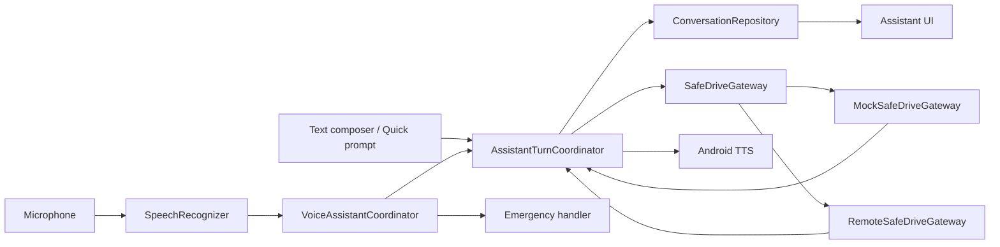

# 12 — Kế hoạch hoàn thiện Android trước khi xây AI Backend

## 1. Mục tiêu tài liệu

Tài liệu này là kế hoạch triển khai nối tiếp sau Android MVP hiện tại. Mục tiêu không phải mở rộng
thêm tính năng AI mới, mà hoàn thiện Android client đến mức:

- text và voice dùng cùng một assistant pipeline;
- TTS hoạt động đúng cho cả câu hỏi text và voice;
- hành vi trên điện thoại có parity rõ ràng với prototype AI Studio;
- Simulator và điều chỉnh tốc độ không bị mất hoặc khó tìm;
- Demo Mode phản hồi nhanh, có số đo latency thay vì cảm nhận;
- Remote Mode không giả vờ thành công, không âm thầm fallback sang Mock;
- API contract được khóa bằng OpenAPI và fixtures để đội backend có thể bắt đầu độc lập;
- app đã được test thật trên điện thoại trước khi gọi là sẵn sàng tích hợp AI Backend.

Đây là **stabilization gate bắt buộc**. Không bắt đầu Gemini orchestration, Gemini Live, streaming
audio hoặc backend production trước khi các tiêu chí Definition of Done ở cuối tài liệu pass.

### 1.1 Quan hệ với các tài liệu kế hoạch cũ

- Các safety invariant trong `00`, `03`, `05` và `09` vẫn giữ nguyên.
- Tài liệu `12` thay thế các quyết định cũ nếu có xung đột về ba điểm: Remote không fallback sang
  Mock, total assistant-turn timeout bao gồm cả session, và lịch stabilization trước backend.
- `03-data-api-contract.md`, `06-test-release-and-rollout.md`, `09-checklists-and-decisions.md` và
  `10-plan-review-and-traceability.md` phải được đồng bộ trong W0; không để hai tài liệu cùng active
  mô tả hai hành vi khác nhau.
- OpenAPI v1 được duyệt tại Gate E là source of truth máy đọc được cho Android và AI Backend. Prose
  chỉ giải thích quyết định, không được ghi đè schema.

## 2. Baseline hiện tại đã xác minh

### 2.1 Trạng thái build

- Android debug APK build thành công.
- 99 JVM unit test pass, 0 failure, 0 error.
- 18 Compose instrumented/UI test đã compile nhưng chưa được chạy trên thiết bị.
- APK debug hiện tại có SHA-256:
  `6D9F1141814A602BA94B54C21DC165EC8E9AE81C663607218F38709E158F5ADA`.
- `SpeechRecognizer` và `TextToSpeech` thật chưa có bằng chứng test trên điện thoại trong repo.
- Repo hiện không có metadata Git tại root; phải tạo baseline source-control trước khi sửa diện rộng.

### 2.2 Kiến trúc thực tế

Repo có hai runtime độc lập:

1. `src/`: prototype React/TypeScript từ AI Studio, chỉ làm tham chiếu UI/copy/flow.
2. `android/`: app native Kotlin + Jetpack Compose, không chạy hoặc reuse runtime React.

Graphify đã phân tích toàn repo thành 1.080 node, 1.768 edge, 64 community và không phát hiện import
cycle. Các bridge chính là `SafeDriveContainer`, `SafeDriveNavHost`, `SafeDriveGateway`,
`AssistantViewModel` và `AndroidSpeechRecognizerController`.

### 2.3 Các gap P0 đã xác định

| ID | Gap | Bằng chứng hiện tại | Ảnh hưởng |
|---|---|---|---|
| GAP-01 | Không có Gemini/AI runtime thật | `@google/genai` chỉ là dependency ở web, không có call runtime; Android không chứa Gemini | Assistant hiện chỉ là rule mock |
| GAP-02 | Text reply Android không gọi TTS | `AssistantViewModel` chỉ append message | Nút TTS gây kỳ vọng sai |
| GAP-03 | Voice bypass conversation | `AndroidSpeechRecognizerController.submitTranscript()` gọi thẳng `AssistantQueryUseCase` | Voice transcript/reply không vào chat history |
| GAP-04 | Không ghi/lưu audio | `onBufferReceived()` bỏ qua buffer; không có `AudioRecord`/`MediaRecorder` | Không thể “lấy file audio” |
| GAP-05 | TTS compatibility chưa hoàn chỉnh | Không kiểm tra kết quả language; manifest chưa query TTS service | Có thể im lặng trên một số thiết bị |
| GAP-06 | Demo có delay nhân tạo | Mock Gateway delay ngẫu nhiên 240–440 ms | Cảm giác chậm dù không có backend |
| GAP-07 | Remote first turn có thể chờ kép | session nằm ngoài assistant timeout | Có thể chờ khoảng 15 s + 12 s |
| GAP-08 | Session luôn khai báo Demo | `SessionCoordinator` hard-code `BackendMode.DEMO` | Remote contract sai semantics |
| GAP-09 | Remote URL trống fallback Mock | `SafeDriveContainer` trả `mockGateway` | UI có thể khiến user tưởng đang chạy Remote |
| GAP-10 | Simulator khó tìm | route chỉ xuất hiện sau Developer Mode, không nằm bottom nav | User tưởng slider tốc độ đã bị xóa |
| GAP-11 | Chưa có device acceptance | instrumented test chưa chạy, voice/TTS chưa test thật | Chưa thể xác nhận trải nghiệm APK |

## 3. Quyết định phạm vi cần khóa

### 3.1 Voice/audio cho bản trước AI Backend

Mặc định khóa theo hướng **transcript-first**:

```text
Microphone
  → Android SpeechRecognizer
  → final transcript text
  → AssistantTurnCoordinator
  → SafeDriveGateway
  → response text/action
  → conversation UI + Android TTS
```

Trong scope này:

- không ghi raw audio;
- không lưu audio vào storage;
- không upload audio lên server;
- không chạy hotword 24/7;
- không giữ microphone khi app background;
- không đưa Gemini key vào APK;
- backend v1 nhận `text + source=VOICE`, không nhận audio binary.

Nếu Product yêu cầu backend phải nhận raw audio, tạo ADR và phase riêng sau khi REST text pass. Phase
đó phải bổ sung consent, retention policy, codec/container, encryption, upload cancellation,
bandwidth budget và privacy review. Không ghép raw-audio scope vào stabilization hiện tại.

### 3.2 TTS

- TTS là output của mọi assistant turn khi setting TTS bật, không phân biệt nguồn text/voice.
- TTS chạy on-device/system engine trong v1.
- Không dùng `synthesizeToFile()` trong v1.
- Thiếu engine/voice tiếng Việt phải hiện lỗi có hướng xử lý; không được im lặng.

### 3.3 Simulator

- Simulator vẫn là Developer Mode tool, không thành user-facing production tab.
- Khi Developer Mode bật, đường mở Simulator phải rõ ở Settings và Cockpit.
- Slider tốc độ phải tồn tại, có giá trị hiện tại, apply feedback và regression test.

### 3.4 Backend

- Android hoàn thiện bằng Mock + MockWebServer trước.
- Remote Mode không được fallback Mock nếu user đã chọn Remote.
- REST contract pass trước; WebSocket/Gemini Live là phase sau.
- Backend là nơi giữ secret, gọi model và thực thi orchestration.

## 4. Kiến trúc đích



```text
Compose surfaces (Cockpit / Assistant / Emergency)
  ├─ text / quick prompt
  └─ voice trigger
        ↓
VoiceController
  ├─ SpeechRecognizer lifecycle
  ├─ partial/final transcript
  └─ VoiceInputEvent.FinalTranscript
        ↓
VoiceAssistantCoordinator
  ├─ emergency routing has priority
  └─ normal transcript → AssistantTurnCoordinator
        ↓
AssistantTurnCoordinator
  ├─ duplicate/cancel/retry/generation
  ├─ writes ConversationRepository
  ├─ AssistantQueryUseCase
  ├─ timing instrumentation
  └─ TtsController when enabled
        ↓
GatewayProvider
  ├─ MockSafeDriveGateway
  └─ RemoteSafeDriveGateway
```

### 4.1 Ownership mới

| Component | Ownership |
|---|---|
| `VoiceController` | mic/STT lifecycle và voice UI state; không gọi assistant gateway |
| `VoiceAssistantCoordinator` | route final transcript sang emergency hoặc assistant |
| `AssistantTurnCoordinator` | một pipeline duy nhất cho text, quick prompt và voice |
| `ConversationRepository` | messages, in-flight turn, error, retry lineage; application scope |
| `AssistantViewModel` | presentation state và UI actions; không tự tạo pipeline khác |
| `TtsController` | interface platform-neutral ở domain; init/readiness/language/queue/speak/stop |
| `AndroidTextToSpeechController` | Android `TextToSpeech` implementation và lifecycle/shutdown |
| `SessionCoordinator` | session đúng mode/base URL, expiry, timeout, invalidation |
| `GatewayProvider` | chọn gateway rõ ràng; không fallback âm thầm |

### 4.2 File dự kiến tạo mới

```text
android/app/src/main/java/vn/edu/haui/hvs/safedrive/
  core/model/
    AssistantTurnModels.kt
  domain/repository/
    ConversationRepository.kt
    TtsController.kt
  domain/usecase/
    AssistantTurnCoordinator.kt
    VoiceAssistantCoordinator.kt
  data/local/
    InMemoryConversationRepository.kt
  core/observability/
    AssistantTurnMetrics.kt
    AssistantTurnMetricsRecorder.kt
```

Chat persistence qua process death không phải gate bắt buộc. Repository application-scope phải giữ
history xuyên navigation/rotation. Nếu Product yêu cầu chat tồn tại sau process kill, dùng Room hoặc
DataStore trong phase sau và ghi ADR; không nhét JSON history lớn vào Preferences DataStore.

## 5. Workstream và task chi tiết

## W0 — Baseline, source control và parity evidence

**Ưu tiên:** P0  
**Ước lượng:** 0,5–1 ngày  
**Phụ thuộc:** không

### Task

- [ ] W0.1 Tạo Git baseline trước khi sửa; commit nguyên trạng, không commit `local.properties`,
      build output hoặc secret.
- [ ] W0.2 Gắn tag hoặc ghi checksum APK baseline.
- [ ] W0.3 Chạy lại `assembleDebug`, `testDebugUnitTest`, `lintDebug`.
- [ ] W0.4 Kết nối ít nhất một điện thoại, chạy `connectedDebugAndroidTest`.
- [ ] W0.5 Quay video AI Studio cho 7 surface: Cockpit, Assistant, Diagnostics, Settings, Simulator,
      Voice, Emergency.
- [ ] W0.6 Tạo `docs/mobile-parity-matrix.md` với cột Prototype / Android / Decision / Acceptance.
- [ ] W0.7 Tạo `docs/mobile-latency-baseline.md` và đo từng mốc latency.
- [ ] W0.8 Đồng bộ các quyết định Remote fallback, total timeout và lịch gate trong `03`, `06`, `09`,
      `10`; ghi rõ tài liệu nào bị supersede.
- [ ] W0.9 Tạo contract-delta draft cho `source`, `locale`, `clientAttemptOf`, error envelope và
      transcript-only voice trước khi sửa DTO/Remote implementation.

### Exit criteria

- Có commit baseline phục hồi được.
- Có device/API/model được ghi lại.
- Có bằng chứng screen-by-screen và latency baseline.
- Mọi test fail hiện hữu được ghi rõ trước khi implementation.
- Không còn contract/timeline active mâu thuẫn nhau.

## W1 — Conversation store và assistant turn duy nhất

**Ưu tiên:** P0  
**Ước lượng:** 1,5–2 ngày  
**Phụ thuộc:** W0

### Task

- [ ] W1.1 Tạo `AssistantTurnSource`: `TEXT`, `VOICE`, `QUICK_PROMPT`, `RETRY`.
- [ ] W1.2 Tạo `AssistantTurnState`: idle/in-flight/success/failure/cancelled, kèm generation,
      requestId, attempt lineage và timings.
- [ ] W1.3 Tạo `ConversationRepository` với `StateFlow<ConversationState>`.
- [ ] W1.4 Chuyển initial messages từ `AssistantViewModel` vào repository.
- [ ] W1.5 Tạo `AssistantTurnCoordinator.submit(text, source, screen)`.
- [ ] W1.6 Coordinator append user bubble đúng một lần, gọi use case, append assistant bubble và
      lưu retry context.
- [ ] W1.7 Chuyển duplicate guard, cancellation và generation guard về coordinator.
- [ ] W1.8 Refactor `AssistantViewModel` thành consumer/delegate của repository/coordinator.
- [ ] W1.9 Đảm bảo ViewModel recreation không reset conversation trong cùng process.
- [ ] W1.10 Bỏ mọi đường request assistant thứ hai ngoài coordinator.
- [ ] W1.11 Khóa policy **global single-flight**: toàn app chỉ có một assistant turn đang xử lý.
      Khi đã in-flight, text/voice/quick prompt mới không tạo request song song; UI báo đang xử lý
      và cho phép hủy turn hiện tại.
- [ ] W1.12 Retry tạo `requestId` mới, giữ `clientAttemptOf` trỏ tới request trước và không append
      lại user bubble.
- [ ] W1.13 Khi cancel sau khi user bubble đã được append, giữ bubble đó, đặt turn là `cancelled` và
      hiện hành động Retry; không tạo assistant bubble giả.

### File sửa chính

- `feature/assistant/AssistantViewModel.kt`
- `feature/assistant/AssistantUiState.kt`
- `feature/assistant/AssistantScreen.kt`
- `SafeDriveContainer.kt`
- `navigation/SafeDriveNavHost.kt`

### Test bắt buộc

- Text turn append user và assistant đúng một lần.
- Quick prompt dùng cùng pipeline.
- Retry không append user bubble mới.
- Double tap send chỉ tạo một request.
- Text đang chạy rồi voice final đến, và ngược lại, không tạo request thứ hai.
- Cancel làm response cũ không ghi đè turn mới.
- Retry có requestId mới và lineage đúng.
- Cancel giữ user bubble, không tạo assistant reply và có thể retry.
- Rotate/recreate Assistant screen không mất history trong cùng process.

### Exit criteria

- Toàn app chỉ có một nơi điều phối assistant turn.
- Không còn assistant request trực tiếp từ `AssistantViewModel` và voice controller song song.
- Existing assistant tests được migrate và pass.

## W2 — Tách STT khỏi assistant và hợp nhất voice/chat

**Ưu tiên:** P0  
**Ước lượng:** 1–1,5 ngày  
**Phụ thuộc:** W1

### Task

- [ ] W2.1 Thêm `Flow<VoiceInputEvent>` vào `VoiceController`.
- [ ] W2.2 `AndroidSpeechRecognizerController` chỉ phát partial/final/error/cancel event.
- [ ] W2.3 Xóa dependency `AssistantQueryUseCase` khỏi `AndroidSpeechRecognizerController`.
- [ ] W2.4 Tạo `VoiceAssistantCoordinator` application-scope.
- [ ] W2.5 Khi emergency active, exact allowlist route sang `EmergencyRepository.respond()`.
- [ ] W2.6 Khi không emergency, final non-blank transcript gọi `AssistantTurnCoordinator` với
      `source=VOICE`.
- [ ] W2.7 Voice user bubble và assistant reply phải xuất hiện trong conversation.
- [ ] W2.8 Voice từ Cockpit, Assistant và Emergency dùng cùng controller nhưng route đúng context.
- [ ] W2.9 Tách ba hành vi: `Hủy nghe` chỉ dừng recognizer khi chưa có final transcript; `Hủy xử lý`
      cancel assistant turn đang in-flight; `Dừng đọc` chỉ dừng TTS của reply đã hoàn tất. Stale
      callback bị generation guard bỏ qua.
- [ ] W2.10 Không lưu raw buffer; comment và test source scan khóa invariant này.
- [ ] W2.11 Xóa `speak()`/`stopSpeaking()` và mọi TTS ownership khỏi `VoiceController`; các call site
      chuyển sang `TtsController`.

### File sửa chính

- `voice/VoiceController.kt`
- `voice/AndroidSpeechRecognizerController.kt`
- `feature/voice/VoiceOverlay.kt`
- `feature/voice/VoiceTrigger.kt`
- `SafeDriveContainer.kt`

### Test bắt buộc

- Blank transcript không gửi.
- Voice transcript tạo chat history.
- Voice reply tạo assistant bubble.
- Emergency phrase không đi vào chat.
- `"Tôi không ổn"` không bị match thành `"Tôi ổn"`.
- Callback cũ sau cancel không khôi phục state.
- Voice turn và text turn không chạy đè nhau ngoài policy đã định.
- Dừng TTS không xóa message hoặc đổi turn đã success thành cancelled.

### Exit criteria

- Text và voice khác nhau ở input adapter, không khác nhau ở assistant/business pipeline.

## W3 — TTS correctness và device compatibility

**Ưu tiên:** P0  
**Ước lượng:** 1 ngày  
**Phụ thuộc:** W1, có thể song song một phần với W2

### Task

- [ ] W3.1 Thêm `<queries>` cho `android.intent.action.TTS_SERVICE` vào manifest.
- [ ] W3.2 Expose `TtsState`: initializing/ready/speaking/unsupported/missing-data/error.
- [ ] W3.3 Kiểm tra return code của `setLanguage(Locale.forLanguageTag("vi-VN"))`.
- [ ] W3.4 Queue tối đa một reply mới nhất khi engine chưa ready; không silent-drop.
- [ ] W3.5 `onDone`/`onError` luôn chuyển state đúng và giữ chat message.
- [ ] W3.6 TTS bật: đọc reply từ text, voice và quick prompt.
- [ ] W3.7 TTS tắt: không gọi engine nhưng vẫn append message.
- [ ] W3.8 Stop speaking không xóa message hoặc cancel conversation đã hoàn tất.
- [ ] W3.9 App background dừng mic và TTS theo MVP policy.
- [ ] W3.10 Hiển thị CTA phù hợp khi thiếu engine/data tiếng Việt.
- [ ] W3.11 Đặt `setSpeechRate(1.0f)` và `setPitch(1.0f)`; không phụ thuộc default khác nhau giữa các
      TTS engine/OEM.
- [ ] W3.12 Nếu sau này expose speech rate/pitch ra Settings, phải persist, giới hạn range an toàn và
      thêm preview; không tự mở rộng UI này trong stabilization khi chưa có yêu cầu Product.
- [ ] W3.13 Chỉ auto-read assistant message thành công từ pipeline. Không đọc snackbar, typed error,
      debug text hoặc system message; Emergency giữ policy voice riêng đã khóa.
- [ ] W3.14 Voice overlay chỉ combine read-only `VoiceInputState` và `TtsState`; không gộp lại
      ownership STT/TTS vào cùng controller.

### File sửa chính

- `AndroidManifest.xml`
- `voice/AndroidTextToSpeechController.kt`
- `domain/repository/TtsController.kt`
- `feature/voice/VoiceOverlay.kt`
- `feature/assistant/AssistantScreen.kt`
- `feature/settings/SettingsScreen.kt`

### Test bắt buộc

- TTS chưa ready được queue và phát sau ready.
- Unsupported language hiện lỗi.
- Text reply gọi speak đúng một lần.
- Voice reply gọi speak đúng một lần.
- TTS off gọi speak 0 lần.
- Typed error/system message gọi speak 0 lần.
- Stop/done/error đưa state về idle.
- Test thật trên ít nhất một thiết bị có voice `vi-VN`.

### Exit criteria

- Toggle TTS phản ánh hành vi thật, không còn là preference không có tác dụng với text.
- Không có trường hợp lỗi TTS bị nuốt hoàn toàn.

## W4 — Latency instrumentation và fast path

**Ưu tiên:** P0  
**Ước lượng:** 1–1,5 ngày  
**Phụ thuộc:** W1–W3

### Timing model

```text
turnStartedAtMs
micRequestedAtMs
recognizerReadyAtMs
firstPartialAtMs
finalTranscriptAtMs
sessionStartedAtMs
requestSentAtMs
responseReceivedAtMs
ttsRequestedAtMs
ttsStartedAtMs
turnCompletedAtMs
```

Từ các timestamp trên tính:

- `micStartToReadyMs`
- `speechToFirstPartialMs`
- `finalTranscriptToRequestMs`
- `sessionMs`
- `networkMs`
- `serverProcessingMs`
- `responseToTtsStartMs`
- `totalTurnMs`

### Task

- [ ] W4.1 Tạo `AssistantTurnMetrics` và recorder injectable/testable.
- [ ] W4.2 Chỉ render raw timing trong Developer Mode.
- [ ] W4.3 Loại bỏ delay 240–440 ms mặc định khỏi Demo Mode.
- [ ] W4.4 Cho phép Developer Mode cấu hình simulated latency: 0/100/500/2000/timeout.
- [ ] W4.5 Start recognizer ngay sau permission, không đợi animation giả.
- [ ] W4.6 Chỉ render LISTENING khi recognizer ready.
- [ ] W4.7 Thêm nút “Kết thúc câu nói” để user chủ động yêu cầu final result.
- [ ] W4.8 Cấu hình end-of-speech extras như optimization có fallback, không coi là guarantee.
- [ ] W4.9 Init TTS sớm và không block main thread.
- [ ] W4.10 Ghi timing vào debug log đã redact, không log transcript/body.

### Latency budget trước backend

Tách budget thành phần app kiểm soát được và phần phụ thuộc provider/OEM. Release-stop chỉ áp dụng
trên reference device/matrix đã ghi ở W0; không tuyên bố mọi Android device có cùng thời gian.

| Flow | Loại | Target | Release stop |
|---|---|---:|---:|
| Final transcript → submit coordinator | app-controlled | p95 ≤ 50 ms | >150 ms |
| Demo text send → reply available | app-controlled | p95 ≤ 100 ms | >300 ms |
| Warm reply → gọi `TtsController.speak()` | app-controlled | p95 ≤ 50 ms | >150 ms |
| Tap mic → recognizer ready | provider/device | p95 ≤ 800 ms trên reference device | >1.500 ms ổn định |
| TTS request → audio start, engine warm | provider/device | p95 ≤ 500 ms | >1.000 ms |
| TTS request → audio start, cold init | provider/device | ghi nhận; target ≤1.500 ms | >3.000 ms ổn định |
| Mobile overhead quanh Remote request | app-controlled, MockWebServer profile | p95 ≤ 300 ms | >700 ms |
| Remote unreachable → actionable error | network policy | ≤5 s | >10 s |

SpeechRecognizer/TTS provider có thể phụ thuộc OEM và network. Báo cáo phải tách STT, app queue,
session, network, server và TTS latency; không gộp thành một số duy nhất. Profile MockWebServer,
reference device, số sample và warm/cold condition phải được ghi cạnh p50/p95.

### Exit criteria

- Có bảng p50/p95 trên device.
- Mọi latency complaint xác định được đang nằm ở STT, session, network, server hay TTS.
- Demo không còn delay giả mặc định.

## W5 — Remote/session correctness và fail-fast

**Ưu tiên:** P0  
**Ước lượng:** 1–1,5 ngày  
**Phụ thuộc:** W1, W4

### Task

- [ ] W5.1 `SessionCoordinator` nhận backend mode hiện tại, không hard-code `DEMO`.
- [ ] W5.2 Session cache key là `(backendMode, baseUrl, contractVersion)`.
- [ ] W5.3 Kiểm tra expiry; session hết hạn phải refresh có mutex/single-flight.
- [ ] W5.4 Đặt start-session trong cùng total timeout của assistant turn.
- [ ] W5.5 Không tạo `sess_local` và tiếp tục query khi Remote start-session fail.
- [ ] W5.6 Thêm `GatewayError.Configuration`; Remote + base URL trống map thành
      `Configuration("REMOTE_BASE_URL_MISSING")`, không trả Mock.
- [ ] W5.7 Đổi mode/base URL phải cancel request cũ, invalidate session và refresh state.
- [ ] W5.8 Observe preferences/mode trong cockpit pipeline để đổi mode thực sự phát request mới.
- [ ] W5.9 Health Demo hiển thị rõ “Local Mock”; Remote health hiển thị host/API version/capability.
- [ ] W5.10 Capability `assistant=false` chặn query với thông báo rõ.
- [ ] W5.11 Hạ network timeout về budget đã khóa; không để first turn chờ kép 20–30 giây.
- [ ] W5.12 HTTP cancellation phải lan từ turn coordinator xuống Retrofit coroutine.
- [ ] W5.13 Remote 5xx/timeout có thể retry hữu hạn theo policy nhưng không đổi gateway sang Mock.
      Local allowlist chỉ là một response offline được gắn nhãn rõ, không được giả là kết quả Remote.
- [ ] W5.14 Assistant query không auto-retry sau khi request đã được gửi. Retry do user chủ động,
      tạo request lineage theo W1; health/session chỉ retry tối đa một lần với lỗi kết nối còn nằm
      trong total deadline.
- [ ] W5.15 Cập nhật toàn bộ exhaustive `when` cho `GatewayError.Configuration` ở Assistant,
      Settings và Cockpit; message phải chỉ rõ cần cấu hình Remote URL.

### Timeout đề xuất

| Layer | Giá trị |
|---|---:|
| Connect timeout | 3 s |
| Read timeout | 8 s |
| Write timeout | 5 s |
| Total assistant turn | 10 s, bao gồm session nếu cần |
| Health check | 5 s |

Outer total deadline 10 giây phải cắt toàn bộ session + query dù timeout tầng network còn thời gian.
Chỉ thay các giá trị mặc định sau khi có số đo LAN, Wi-Fi yếu và staging; không tăng timeout chỉ để
che server chậm.

### File sửa chính

- `core/common/GatewayError.kt`
- `core/network/NetworkModule.kt`
- `data/remote/RemoteSafeDriveGateway.kt`
- `domain/usecase/AssistantQueryUseCase.kt`
- `domain/usecase/SessionCoordinator.kt`
- `SafeDriveContainer.kt`
- các UI error mapper exhaustive theo compiler report

### Test bắt buộc

- Start session gửi đúng `REMOTE`.
- Remote URL trống không gọi Mock.
- Remote offline fail đúng typed error.
- Remote 5xx/timeout không đổi sang Mock.
- Assistant query không auto-retry; user retry tạo lineage đúng.
- Session timeout nằm trong total timeout.
- Concurrent first requests chỉ tạo một session.
- Đổi URL không dùng session của host cũ.
- Backend capability mismatch hiển thị đúng.

### Exit criteria

- Không có “Remote giả”.
- Remote failure có thời gian hữu hạn và message actionable.
- Mock/Remote vẫn pass shared contract tests.

## W6 — UI parity, Simulator và khả năng tìm thấy tính năng

**Ưu tiên:** P1  
**Ước lượng:** 1 ngày  
**Phụ thuộc:** W1–W3

### Task

- [ ] W6.1 Hoàn thiện `mobile-parity-matrix.md`; mọi khác biệt phải có decision, không khác ngẫu nhiên.
- [ ] W6.2 Khi Developer Mode bật, Settings hiện CTA “Mở Simulator” ngay sau toggle hoặc có anchor rõ.
- [ ] W6.3 Cockpit hiện Developer chip/shortcut Simulator khi Developer Mode bật.
- [ ] W6.4 Simulator có top app bar, Back và trạng thái mode rõ ràng.
- [ ] W6.5 Speed slider giữ range 0–160 km/h, hiển thị giá trị và unit.
- [ ] W6.6 Nhấn Apply có snackbar/feedback với giá trị tốc độ đã áp dụng.
- [ ] W6.7 Chốt semantics: slider chỉ thay đổi draft; state toàn app chỉ đổi khi Apply.
- [ ] W6.8 Reset nominal cập nhật Cockpit/Diagnostics/Assistant context cùng một StateFlow.
- [ ] W6.9 Quick prompts cuộn ngang hoặc wrap an toàn trên 360 dp.
- [ ] W6.10 Voice overlay hiển thị partial transcript, final transcript, reply/error và stop/cancel đúng.
- [ ] W6.11 TTS icon hiển thị ready/speaking/off/error, không chỉ boolean setting.

### Acceptance

- User được hướng dẫn đường mở Simulator: `Settings → Developer Mode → Mở Simulator`.
- Speed slider có regression test và thay đổi Cockpit sau Apply.
- Không overlap ở 360×800, 390×844, 412×915, 844×390.
- Font scale 1.3 không che primary action.
- Normal user không thấy endpoint/raw timing/reason code/simulator.

## W7 — Contract freeze và backend handoff package

**Ưu tiên:** P0 trước khi backend code  
**Ước lượng:** 1–1,5 ngày  
**Phụ thuộc:** contract-delta draft ở W0; freeze cuối phụ thuộc W5, W6

### Artifact bắt buộc

```text
openapi/
  safedrive-v1.yaml
  examples/
    health-ok.json
    session-start.json
    state-update.json
    assistant-text-query.json
    assistant-voice-query.json
    assistant-response.json
    action-confirm.json
    emergency-snapshot.json
    error-envelope.json
docs/
  backend-handoff.md
  assistant-action-allowlist.md
  latency-budget.md
```

### Task

- [ ] W7.1 Chuyển contract-delta draft từ W0 thành OpenAPI v1; không đợi đến cuối mới phát hiện
      Android DTO và contract prose khác nhau.
- [ ] W7.2 Khóa common error envelope: code/message/requestId/retryable/serverTimeMs.
- [ ] W7.3 Bổ sung `source`, `locale` và `clientAttemptOf` vào assistant request.
- [ ] W7.4 Bổ sung `serverProcessingMs`, `model`, `finishReason`, `safetyMetadata?` vào response theo
      optional/additive rules.
- [ ] W7.5 Khóa action allowlist và confirmation rules.
- [ ] W7.6 Khóa `contractVersion`, backward compatibility và capability negotiation.
- [ ] W7.7 Tạo example transcript-only voice request.
- [ ] W7.8 Xác nhận không có raw audio endpoint trong v1.
- [ ] W7.9 Cập nhật DTO/mappers/fixtures theo schema.
- [ ] W7.10 Tạo serialization/contract tests từ examples.
- [ ] W7.11 Tạo backend handoff mô tả sequence, authority, timeout, idempotency và safety invariants.
- [ ] W7.12 Chạy diff/check để `03-data-api-contract.md`, DTO, fixtures và OpenAPI không còn mâu thuẫn.

### Assistant request v1 đề xuất

```json
{
  "sessionId": "sess_001",
  "requestId": "req_001",
  "text": "Xe đang có lỗi gì?",
  "source": "VOICE",
  "locale": "vi-VN",
  "clientAttemptOf": null,
  "context": {
    "stateVersion": 123,
    "screen": "cockpit"
  }
}
```

### Assistant response v1 đề xuất

```json
{
  "requestId": "req_001",
  "message": {
    "id": "msg_001",
    "sender": "SAFEDRIVE",
    "text": "Hiện tại không phát hiện mã lỗi DTC đang hoạt động.",
    "timestampMs": 1780000000000,
    "risk": null,
    "actions": [],
    "route": "safety_fast_path"
  },
  "serverTimeMs": 1780000000000,
  "serverProcessingMs": 180,
  "model": "backend-selected",
  "finishReason": "STOP"
}
```

`model` chỉ phục vụ observability trong Developer Mode; Android không tự chọn model production.

### Exit criteria

- OpenAPI validate thành công.
- Android Mock/Remote serialization pass cùng examples.
- Backend developer có thể tạo server stub mà không đọc source Compose.
- Không còn quyết định contract bắt buộc bị để ngỏ.

## W8 — Device QA, release candidate và backend-ready gate

**Ưu tiên:** P0  
**Ước lượng:** 1–2 ngày  
**Phụ thuộc:** W0–W7

### Test suite

- [ ] W8.1 Chạy toàn bộ JVM unit tests clean, không dựa solely vào UP-TO-DATE.
- [ ] W8.2 Chạy lint debug/release.
- [ ] W8.3 Chạy toàn bộ instrumented tests trên điện thoại hoặc emulator.
- [ ] W8.4 Test microphone permission: allow, deny, deny permanently, Settings return.
- [ ] W8.5 Test recognizer: success, blank, no match, timeout, network error, cancel.
- [ ] W8.6 Test TTS: ready, init delay, missing Vietnamese, stop, background.
- [ ] W8.7 Test text/voice conversation parity.
- [ ] W8.8 Test Demo latency 0/100/500/2000/timeout profiles.
- [ ] W8.9 Test Remote với MockWebServer/LAN: success, slow, timeout, invalid JSON, 401/409/422/5xx.
- [ ] W8.10 Test mode/base URL switching và session invalidation.
- [ ] W8.11 Test Simulator speed/apply/reset và 8 presets.
- [ ] W8.12 Test Emergency 5/15/10, rotation, process recreation và exact voice cancel.
- [ ] W8.13 Test portrait/landscape/font scale/TalkBack basic traversal.
- [ ] W8.14 Build release candidate, scan secret/forbidden fields và audit manifest/network config.
- [ ] W8.15 Cài RC APK từ file phân phối, không chỉ Run từ Android Studio.

### Device matrix tối thiểu

| Profile | Bắt buộc |
|---|---|
| Điện thoại thật của owner | Có |
| 390×844 portrait emulator | Có |
| 844×390 landscape emulator | Có |
| API thấp nhất minSdk hoặc representative API 26–29 | Ít nhất smoke test |
| API target 37 | Regression bắt buộc |
| Wi-Fi tốt / mạng chậm / offline | Có |

### Release evidence

- APK/AAB checksum.
- Test report mới.
- Instrumented test result.
- Device/OS/TTS engine/speech provider matrix.
- Latency p50/p95.
- Parity matrix.
- Known limitations đã cập nhật.
- Video demo end-to-end.

## 6. Lịch triển khai đề xuất

### Một Android developer

| Ngày | Workstream | Gate cuối ngày |
|---:|---|---|
| 0 | W0 baseline/Git/device evidence | baseline phục hồi được, gap được ghi |
| 1–2 | W1 conversation/turn coordinator | text pipeline pass |
| 3 | W2 voice routing | voice vào cùng chat pipeline |
| 4 | W3 TTS | text + voice TTS pass trên fake và device |
| 5 | W4 latency | timing breakdown + Demo fast path |
| 6 | W5 Remote/session | fail-fast, no mock masquerade |
| 7 | W6 parity/Simulator | speed control discoverable và tested |
| 8 | W7 OpenAPI/handoff | contract freeze |
| 9–10 | W8 device QA/RC | backend-ready gate pass |

Đây là ước lượng lập kế hoạch, không phải cam kết release. Best case là **8–11 ngày làm việc** khi
device/provider hoạt động đúng và không có regression lớn; nên reserve **10–14 ngày** cho một
developer để xử lý lỗi OEM, contract drift và re-test RC.

### Hai Android developer

- Developer A: W1, W4, W5, W7.
- Developer B: W2, W3, W6, W8 device harness.
- Cả hai cùng review các thay đổi voice/emergency/contract.
- Không merge W2 trước khi interface từ W1 được khóa.

## 7. Phase gates

### Gate A — Unified assistant

- [ ] Text/quick/voice dùng một coordinator.
- [ ] Conversation không mất khi đổi tab.
- [ ] Duplicate/retry/cancel tests pass.

### Gate B — Audio UX complete

- [ ] STT thật chạy trên device.
- [ ] Text và voice đều được TTS khi bật.
- [ ] Missing/unsupported TTS có lỗi rõ.
- [ ] Không ghi raw audio.

### Gate C — Latency and Remote correctness

- [ ] Demo đạt latency budget.
- [ ] Có timing breakdown.
- [ ] Remote không fallback Mock.
- [ ] Session đúng mode và nằm trong total timeout.

### Gate D — UX parity

- [ ] Parity matrix không còn mục Unknown.
- [ ] Simulator/speed control discoverable trong Developer Mode.
- [ ] Target layouts pass.

### Gate E — Backend-ready

- [ ] OpenAPI + examples validate.
- [ ] Android DTO/contract tests pass.
- [ ] Device QA và RC APK pass.
- [ ] Backend handoff được owner Android/backend review.

Chỉ bắt đầu AI Backend khi Gate E pass.

## 8. Definition of Done trước AI Backend

### Functional

- [ ] Text, quick prompt và voice cùng tạo conversation turn.
- [ ] Voice transcript/reply xuất hiện trong chat.
- [ ] TTS hoạt động cho text và voice.
- [ ] Stop/cancel/background lifecycle đúng.
- [ ] Simulator có speed slider 0–160 km/h và Apply cập nhật toàn app.
- [ ] Demo/Remote state được phân biệt rõ.
- [ ] Emergency voice routing vẫn ưu tiên và an toàn.

### Performance

- [ ] Demo latency p95 trong budget.
- [ ] STT, session, network, server và TTS timing tách riêng.
- [ ] Remote unreachable fail trong budget.
- [ ] Không có session + query wait kép ngoài total timeout.

### Quality

- [ ] Unit/lint/build pass.
- [ ] Instrumented tests chạy và pass trên device.
- [ ] Voice/TTS test thật có evidence.
- [ ] Không có secret/API key/raw transcript trong log.
- [ ] Release scan và manifest/network audit pass.

### Backend handoff

- [ ] OpenAPI v1.
- [ ] Example JSON.
- [ ] Error envelope.
- [ ] Action allowlist.
- [ ] Idempotency/session rules.
- [ ] Latency budget.
- [ ] Mock/Remote contract test package.
- [ ] `backend-handoff.md`.
- [ ] `03-data-api-contract.md`, DTO, fixtures và OpenAPI thống nhất.

## 9. Release-stop criteria

Dừng release và không bắt đầu backend integration nếu có một trong các điều kiện:

- voice reply không xuất hiện trong chat;
- text TTS toggle không có tác dụng;
- app nói đang listening khi recognizer chưa ready;
- Remote Mode fallback Mock mà không báo;
- session gửi sai mode;
- first Remote turn có thể vượt total timeout;
- Simulator/speed control không truy cập được sau khi bật Developer Mode;
- instrumented tests chưa chạy;
- chưa test voice/TTS trên điện thoại;
- OpenAPI chưa khóa;
- secret/model key nằm trong APK;
- emergency exact-match hoặc deadline regression.

## 10. Rủi ro và giảm thiểu

| ID | Rủi ro | Mức | Giảm thiểu |
|---|---|---:|---|
| R1 | SpeechRecognizer khác nhau theo OEM | Cao | manual finish, typed fallback, device matrix |
| R2 | TTS thiếu voice tiếng Việt | Cao | readiness/language check, CTA cài voice data |
| R3 | Refactor conversation gây duplicate | Cao | coordinator single-flight + generation tests |
| R4 | App-wide voice nhưng ViewModel không tồn tại | Cao | application-scope repository/coordinator |
| R5 | Remote timeout che backend chậm | Cao | total budget + timing breakdown + fail-fast |
| R6 | Contract drift khi backend bắt đầu | Cao | OpenAPI + examples + shared contract tests |
| R7 | Scope creep sang raw audio/Gemini Live | Cao | transcript-first ADR và Gate E |
| R8 | Simulator leak cho normal user | Trung bình | Developer Mode defense-in-depth |
| R9 | TTS đọc nội dung safety không phù hợp | Trung bình | backend/route policy + stop/cancel + allowlist |
| R10 | Không có Git baseline | Cao | W0 bắt buộc trước code |
| R11 | Prose contract cũ mâu thuẫn plan/OpenAPI | Cao | W0 sync + W7 machine-readable diff |

## 11. Những việc không làm trong stabilization này

- Không gọi Gemini trực tiếp từ Android.
- Không đưa API key vào APK.
- Không upload hoặc lưu raw audio.
- Không làm hotword 24/7/foreground service.
- Không làm WebSocket/Gemini Live trước REST contract gate.
- Không làm Maps, VHAL, camera/DMS, wearable production.
- Không bật cứu hộ/SMS/call thật.
- Không thay đổi emergency safety invariant `realEmergencyDispatchEnabled=false`.
- Không thêm replay TTS vào stabilization; đưa vào backlog UX sau Gate E.

## 12. Backlog ngay sau Gate E

Khi Android backend-ready, AI Backend có thể triển khai theo thứ tự:

1. OpenAPI server stub + health/session/state.
2. Deterministic safety fast path không dùng LLM.
3. Assistant orchestration server-side.
4. Action allowlist/confirmation/idempotency.
5. Model provider adapter và secret management.
6. Observability, trace/request id, server latency.
7. Contract tests với Android fixtures.
8. Staging deployment và Remote Mode end-to-end.
9. Chỉ sau đó đánh giá streaming response, WebSocket hoặc Gemini Live.
10. Đánh giá nút replay TTS; replay chỉ đọc message đã có, không gọi backend.

## 13. Báo cáo bắt buộc sau mỗi workstream

Mỗi workstream phải cập nhật:

- file đã sửa/tạo;
- quyết định kiến trúc;
- test command và kết quả;
- latency trước/sau nếu liên quan;
- screenshot/video nếu liên quan UI;
- known gap còn lại;
- gate pass/fail;
- contract/documentation đã cập nhật.

Không được đánh dấu `Done` chỉ vì compile. `Done` yêu cầu exit criteria và bằng chứng tương ứng.
